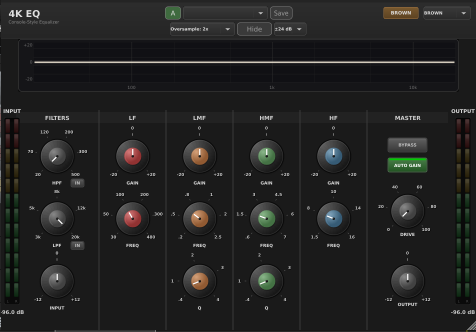
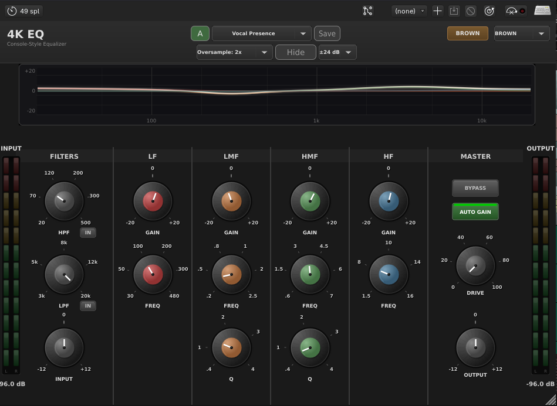
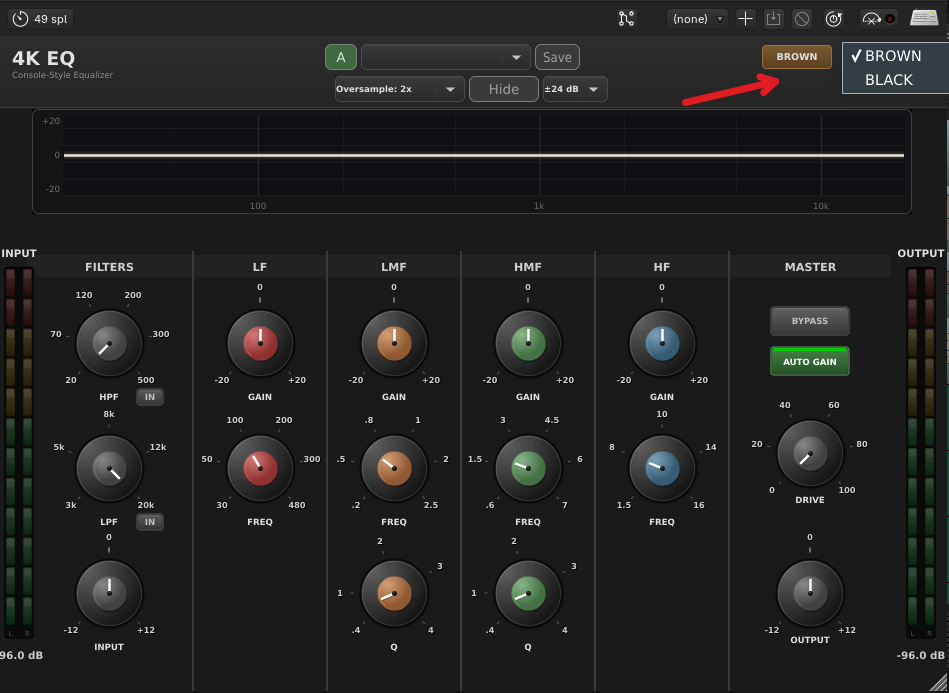
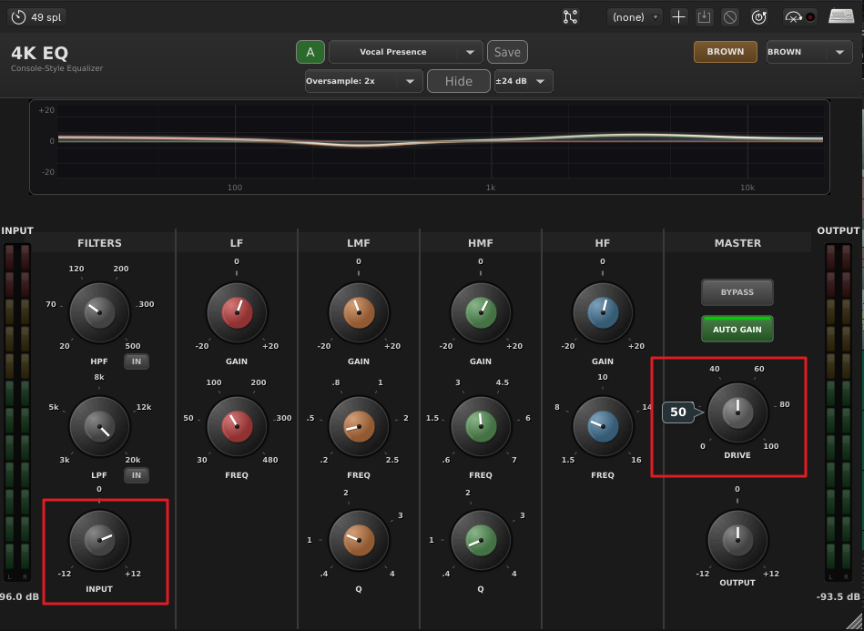

# 4K-EQ

## Overview

4K-EQ is a 4-band parametric equalizer modeled on the British large-format console channel strip. The four bands (Low, Low-Mid, High-Mid, High) cover the full audio spectrum, with separate high-pass and low-pass filters at the input. Two character modes ("Brown" and "Black") swap the EQ curves between the E-series and G-series console designs.

Use it where you would use a console EQ: tonal shaping during the mix, gentle pre-master sweetening, broad corrective work on individual sources. The bands are musical rather than surgical; if you need to notch out a single resonant peak, reach for Multi-Q's Digital mode instead.

The console-style saturation stage adds a small amount of harmonic color when driven, and stays clean when the input gain is conservative. Auto-gain compensation keeps the output level matched to input as you boost and cut, so an A/B comparison reflects tone changes only.

## Quick Start

1. Insert 4K-EQ on the source you want to shape. The interface shows four band sections (LF, LM, HM, HF) with HPF on the far left and LPF on the far right.
2. Pick a character with the **EQ Type** switch at the top: **Brown** for the warmer, slightly soft E-series sound, **Black** for the more aggressive G-series with extended highs and lows.
3. Sweep one band's **Frequency** while you boost its **Gain** by about 6 dB. Listen for the area you want to enhance, then back the gain off to 2 to 4 dB.
4. Use the **Q** knob (on LM and HM) to widen or narrow the affected range. The default Q (0.7) is broad and musical; raise toward 2 for surgical work.
5. The **HPF** and **LPF** are off by default. Toggle them on to clean up rumble (HPF at 60 to 100 Hz on most sources) or tame harshness (LPF only when needed).
6. Leave **Auto Gain Compensation** on while you work. It keeps levels matched so your ears focus on tone, not loudness.

You should hear the source change tonal balance without changing apparent level. If you do hear a level change, double-check Auto Gain is on and that you have not pushed any band past 12 dB.

To dial in an exact setting, double-click any knob to type a value directly instead of dragging.

## Workflows

### Vocal presence and clarity

**Source:** A lead vocal that sits in the mix but needs more presence and air.
**Goal:** Lift the singer forward without harshness.

Settings:

- **EQ Type:** Brown
- **HPF:** On, 80 Hz
- **LF Gain:** -3 dB at 300 Hz, Bell Mode On
- **HM Gain:** +4 dB at 3500 Hz, Q 0.7
- **HF Gain:** +2 dB at 8000 Hz, Shelf
- Other bands flat.

Why this works. The HPF at 80 Hz removes proximity rumble and headphone bleed without thinning the body. The LF cut at 300 Hz tames the boxy buildup that lives there in close-mic'd vocals. The HM boost at 3.5 kHz adds intelligibility (the consonant range). The 8 kHz shelf adds air. The Brown character keeps the boost gentle. This matches the "Vocal Presence" factory preset.

If the vocal sounds harsh after this, drop HM Q to 0.5 (wider, softer boost) or move the HM frequency down to 2.5 kHz. If it still sounds dull, try Black mode for a touch more clarity.

### Kick drum punch

**Source:** Close-mic'd kick drum.
**Goal:** Solid low-end thump and audible click for cut-through.

Settings:

- **EQ Type:** Brown
- **HPF:** On, 30 Hz (removes sub-rumble below the fundamental)
- **LF Gain:** +4 dB at 50 Hz, Shelf
- **LM Gain:** -2.5 dB at 200 Hz, Q 0.8
- **HM Gain:** +3 dB at 2000 Hz, Q 1.5
- **HF Gain:** flat
- **Saturation:** 10%

Why this works. The 50 Hz shelf adds weight; bell mode at the same frequency would only add to a narrow range, and you want the whole low end lifted. The 200 Hz cut removes "boxy" buildup that competes with the bass. The 2 kHz bell with a tight Q (1.5) brings out the beater click. A small amount of console saturation (10%) thickens the body without obvious distortion. This matches the "Kick Punch" factory preset.

For a thumpier kick, raise LF center to 70 Hz. For more click, raise HM gain to +5 dB.

### Mix bus glue

**Source:** Stereo mix bus, near final balance.
**Goal:** Add console color and gentle high-end sheen without changing the mix.

Settings:

- **EQ Type:** Black (G-series for slightly tighter low end)
- **LF Gain:** +2 dB at 60 Hz, Shelf
- **HM Gain:** -2 dB at 2500 Hz, Q 0.8
- **HF Gain:** +2.5 dB at 10000 Hz, Shelf
- **Saturation:** 20%
- **Auto Gain Compensation:** On

Why this works. A wide 2 dB shelf at 60 Hz adds weight without muddying. A gentle 2 dB scoop at 2.5 kHz pulls the harshness band back, which can fight a mix when many instruments live in that range. The 10 kHz shelf adds gloss. 20% saturation gives the bus the harmonic glue of a real console without obvious distortion. This is the "Bright Mix" factory preset's approach. The "Glue Bus" preset uses similar settings with a slightly higher saturation and a touch more low end.

## Parameter Reference

### Filters (HPF and LPF)

- **HPF Frequency:** 20 to 500 Hz, default 20. The corner frequency of the high-pass filter (18 dB/oct). Use 60 to 120 Hz on vocals and most instruments to remove rumble.
- **HPF Enabled:** Off by default. Truly bypassed when off (no phase or magnitude effect on the signal).
- **LPF Frequency:** 3 to 20 kHz, default 20 kHz. The corner frequency of the low-pass filter (12 dB/oct).
- **LPF Enabled:** Off by default. Use sparingly; over-aggressive low-pass filtering dulls a track.

### Low frequency band (LF)

- **LF Gain:** -20 to +20 dB, default 0. Hardware spec is ±15 dB on Brown and ±18 dB on Black, but the plugin lets you go further when you need to.
- **LF Frequency:** 30 to 480 Hz, default 100. Center frequency for bell mode, corner frequency for shelf mode.
- **LF Bell Mode:** Off (shelf) by default. Shelf mode boosts or cuts everything below the frequency; bell mode affects only a band around the frequency.

### Mid bands (LM and HM)

- **LM Gain / HM Gain:** -20 to +20 dB. Always bell-shaped (no shelf mode on the mid bands).
- **LM Frequency:** 200 to 2500 Hz, default 600.
- **HM Frequency:** 600 to 7000 Hz, default 2000.
- **LM Q / HM Q:** 0.4 to 4.0, default 0.7. Lower Q is wider and more musical; higher Q is narrower and more surgical.

### High frequency band (HF)

- **HF Gain:** -20 to +20 dB.
- **HF Frequency:** 1500 to 16000 Hz, default 8000. Black mode extends further to 16 kHz; Brown is more focused around 7 kHz.
- **HF Bell Mode:** Off (shelf) by default.

### Global

- **EQ Type:** Brown (E-series) or Black (G-series). Brown is warmer and slightly softer; Black is brighter with extended low and high response.
- **Bypass:** Reports zero latency to the host while bypassed.
- **Input Gain / Output Gain:** -12 to +12 dB. Use Input Gain to drive the saturation stage harder; Output Gain to compensate.
- **Saturation:** 0 to 100%, default 0. Console-style harmonic distortion. Stays clean at 0; adds warmth at 10 to 25%; gets obviously colored above 50%.
- **Oversampling:** 2x or 4x, default 2x. 4x reduces aliasing in the saturation stage at the cost of more CPU.
- **Spectrum Pre/Post:** Default Post. The spectrum analyzer view shows audio after the EQ; flip to Pre to see the input signal.
- **Auto Gain Compensation:** On by default. Keeps output loudness matched to input so EQ comparisons are level-matched.

## Tips and Traps

- **Brown vs Black is not a "better" choice.** They are voiced differently. Brown is the smoother, more musical option for vocals and acoustic sources. Black is more aggressive and works well on drums, bass, and full mixes. Try both on the same source and pick what your ears prefer.

- **Bell vs shelf changes the character a lot.** A shelf at 100 Hz at +4 dB lifts everything below 100 Hz; a bell at 100 Hz at +4 dB only lifts a narrow range around 100 Hz. The wrong choice can sound boxy or thin.
- **Saturation is gain-driven.** With Input Gain at 0 dB and Saturation at 50%, you may hear very little change. Push Input Gain to +6 to +9 dB and use Output Gain to compensate; the saturation will be much more apparent.

- **Auto Gain Compensation lies a little.** It level-matches RMS, but EQ changes can shift perceived loudness even at matched RMS. Trust your ears, and disable Auto Gain temporarily if you want to confirm an absolute level change.
- **The HPF and LPF are sharp.** 18 dB/oct on the HPF will be obvious; do not set the HPF too high on bass instruments.

## Presets Explained

4K-EQ ships with 14 factory presets across 7 categories. Each one is a starting point; expect to nudge frequencies and gains based on your source.

### Vocals

- **Vocal Presence.** Brown mode, +4 dB HM at 3.5 kHz, +2 dB HF shelf at 8 kHz, gentle 300 Hz cut, HPF at 80 Hz. The classic vocal-forward setting.

### Drums

- **Kick Punch.** +4 dB LF shelf at 50 Hz, -2.5 dB at 200 Hz, +3 dB at 2 kHz with tight Q. Body, mud cut, click.
- **Snare Crack.** Bell-shaped boost at 250 Hz for body, 5 kHz for crack, plus 8 kHz shelf for attack.
- **Drum Bus Punch.** Wide LF lift at 70 Hz, 350 Hz cut, 3.5 kHz boost, gentle 10 kHz shelf, 25% saturation, Black mode.

### Bass

- **Bass Warmth.** +4 dB shelf at 80 Hz, slight 400 Hz cut, broad 1.5 kHz bell. For round, full bass.
- **Bass Guitar Polish.** Tighter low end (60 Hz shelf), 250 Hz cut, presence boost at 1.2 kHz, slight 4.5 kHz top.

### Guitar

- **Acoustic Guitar.** Slight 100 Hz cut for boxiness, 2.5 kHz boost for fingernoise clarity, 12 kHz shelf for sparkle.

### Keys

- **Piano Brilliance.** 80 Hz shelf for foundation, 500 Hz cut to clear the mids, 2 kHz and 8 kHz boosts for definition and shine.

### Mix Bus

- **Bright Mix.** Wide 60 Hz shelf, gentle 2.5 kHz scoop, 10 kHz shelf with 20% saturation. Adds clarity without changing the mix.
- **Glue Bus.** Similar to Bright Mix with slightly more low end and saturation. The "console color" preset.

### Creative

- **Telephone EQ.** Aggressive HPF and LPF (300 Hz and 3 kHz) with a 1 kHz bell boost. Lo-fi telephone effect.
- **Air & Silk.** Top-end-only setting: 7 kHz boost, 15 kHz shelf. Adds air without touching the body.

### Mastering

- **Master Sheen.** Subtle 5 kHz and 16 kHz boosts, 10% saturation. Adds polish without changing the mix.
- **Master Bus Sweetening.** Gentle 50 Hz lift, 600 Hz cut, 4 kHz and 15 kHz boosts, 15% saturation, slight input cut. The most subtle preset; use as a starting point for mastering.

## Troubleshooting

**The EQ has no audible effect.** Check that **Bypass** is off and the band you are adjusting has its **Gain** set to something other than 0 dB. The HPF and LPF must be **Enabled** to do anything; they are off by default.

**Boosting any band makes the mix louder.** That is expected when **Auto Gain Compensation** is off. Turn it on to compare EQ shapes at matched levels. If Auto Gain is on and you still hear level changes, the EQ is shaping the spectrum in a way that affects perceived loudness even at matched RMS.

**The saturation knob seems to do nothing.** The saturation stage is gain-driven; it only colors when the signal is hot enough to drive it. Turn up **Input Gain** by 6 to 9 dB and compensate with **Output Gain**, or feed the plugin a hotter input signal.
