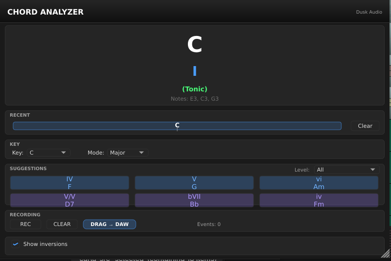
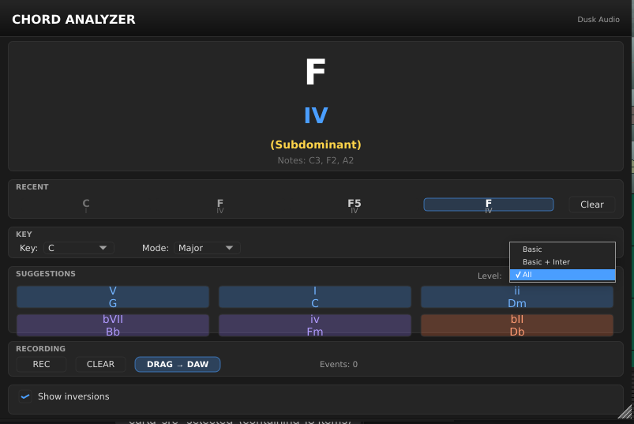

# Chord Analyzer

## Overview

Chord Analyzer is a MIDI plugin that watches the notes coming into your DAW and tells you what chord you are playing. It detects the chord root, quality (major, minor, 7th, sus, etc.), bass note for slash chords, and inversion. It also shows theory-aware suggestions: which chords are typical in the key you have selected, and which substitutions are available.

Use it for transcription (figure out what a recording is doing), for learning (see chord names while you play), for songwriting (browse suggested next chords), and for live performance (display the chord on a screen so the rest of the band can follow).

It is not a chord-generation tool (it does not play chords for you), and it is not a MIDI processor (it passes notes through unchanged). It analyzes; it does not modify.

The plugin ships in three variants because different DAWs handle MIDI-only plugins differently. Picking the right variant for your DAW is the most important first step.

## Quick Start

1. Identify the right variant for your host:
   - **Chord Analyzer MIDI** for desktop DAWs that recognize MIDI-only plugins (Bitwig, Reaper, Logic, Cubase, Ardour, Carla).
   - **Chord Analyzer** (the instrument version) for DAWs that need a plugin to claim audio output (Ableton Live, FL Studio).
   - **Chord Analyzer Headless** for headless LV2 hosts that have no plugin GUI (Zynthian and similar).
2. Insert the plugin in front of your synth or instrument track. Detailed routing per-DAW is in the next section.
3. Set the **Key Root** and **Key Mode** at the top of the plugin window to match the song you are playing in. C Major is the default.
4. Play notes on your MIDI controller. The detected chord appears in the main display, with inversions and theory suggestions below.

You should see the chord name update as you play (for example, holding C, E, and G shows "C major"; adding B♭ shows "C7"). If the chord display stays empty, check that MIDI is reaching the plugin and that you are holding at least three notes.

## Workflows

The right setup depends on your DAW. The plugin always sits in front of your synth or instrument; what differs is how the DAW routes MIDI through it. Pick your DAW from the list below.

### Bitwig Studio

1. Add your synth to a MIDI track as normal.
2. In the device chain, click **+** before your synth.
3. Search for **Chord Analyzer MIDI** in the **Note FX** category and add it.
4. MIDI passes through automatically; your synth still receives all the notes.

### Reaper

1. Open the FX chain on your MIDI/instrument track.
2. Click **Add** and search for **Chord Analyzer MIDI** (VST3).
3. Drag it above your synth in the chain.
4. MIDI passes through to your synth automatically.

### Logic Pro

1. On your instrument track, click the **MIDI FX** slot (above the Instrument slot).
2. Choose **Chord Analyzer MIDI** under Dusk Audio.
3. The plugin receives MIDI from the track and passes it through to your instrument.

### Cubase / Nuendo

1. On your instrument track, add **Chord Analyzer MIDI** as a **MIDI insert**.
2. The plugin receives MIDI from the track automatically.
3. Your instrument remains unchanged.

### Ableton Live

Ableton does not list MIDI-only plugins in MIDI tracks the same way other DAWs do, so use the **instrument version** with an Instrument Rack:

1. Load your synth on a MIDI track as normal.
2. Select your synth and press **Cmd+G** (Mac) or **Ctrl+G** (Windows) to group it into an **Instrument Rack**.
3. Click the **Show Chain List** button (three horizontal lines on the left side of the rack).
4. Right-click in the empty space below your synth's chain and choose **Create Chain**.
5. Drag **Chord Analyzer** (the instrument version, not MIDI) from the browser into the new empty chain.
6. Both chains receive the same MIDI; your synth produces sound, the Chord Analyzer displays chords.

### FL Studio

Use the **instrument version** with Patcher:

1. Add a **Patcher** instance to your channel rack.
2. Inside Patcher, add both **Chord Analyzer** and your synth as nodes.
3. Route the MIDI input to both plugins in parallel.
4. Route only your synth's audio output to the Patcher output.
5. Both plugins receive MIDI; your synth produces sound, the Chord Analyzer displays chords.

### Desktop LV2 hosts (Ardour, Carla)

Use **Chord Analyzer MIDI**; it declares no audio ports and includes the full custom visualizer in the host plugin window.

1. Add **Chord Analyzer MIDI** to the MIDI chain before your synth.
2. MIDI passes through to the next plugin in the chain.
3. Open the plugin window to see the full chord display.

### Headless LV2 hosts (Zynthian)

Use **Chord Analyzer Headless**; it exposes the detected chord through native LV2 output control ports so the host can render the values in its own parameter view.

1. Install the bundle from the `chord-analyzer-headless-*.zip` (separate download).
2. Add **Chord Analyzer Headless** to your MIDI chain before your synth.
3. The detected root, quality, bass, and inversion appear as live values in your host's plugin parameter view.

## Parameter Reference

Chord Analyzer exposes five user-facing parameters plus four read-only detection outputs.

### Key context

- **Key Root:** 12 choices, C through B (with enharmonic spellings shown). Default C. Sets the tonal center for theory-aware suggestions. The detector itself is key-agnostic (it identifies chord names regardless of key), but the suggestion display uses this to highlight chords that fit your key.
- **Key Mode:** Major or Minor, default Major. Combined with Key Root, defines the key for suggestions. Set this to match the song you are playing or transcribing.

### Detection settings

- **Suggestion Level:** Basic Only, Basic + Intermediate, or All (+ Advanced). Default All. Controls how many tiers of suggested chord substitutions appear below the detected chord. Basic shows only diatonic triads (the seven chords in the key). Intermediate adds 7th chords and common borrowed chords. Advanced adds tritone substitutions, secondary dominants, and modal interchange options.
- **Show Inversions:** On by default. When on, the display tells you which inversion of the detected chord you are playing (root position, first inversion, second inversion, third inversion for 7ths). Turn off if you want a less cluttered display.
- **Respect Sustain:** On by default. When on, MIDI CC 64 (sustain pedal) holds the detected chord on screen until you release the pedal, even if you let go of the keys. Useful for transcription workflows where you want to lift your hands to type or take notes. Turn off if your controller sends sustain CCs you do not want the plugin reacting to.

### Detection outputs (read-only)

These four parameters expose the detection result for host automation, screen-recording overlays, and the Headless variant's parameter-driven display:

- **Detected Root:** Current chord root (12 values).
- **Detected Quality:** Current chord quality (major, minor, 7, maj7, m7, sus2, sus4, dim, aug, etc.).
- **Detected Bass:** Bass note for slash chords (like C/E or G/B).
- **Detected Inversion:** Which inversion is currently being played.

You cannot set these from the host; they update automatically as the plugin detects chords.

## Tips and Traps

- **The variant matters more than the version.** Most "I cannot find the plugin" issues are users looking for the MIDI variant in Ableton (which only sees the instrument variant) or the instrument variant in Logic (which puts the MIDI variant in the MIDI FX slot).
- **The plugin needs at least three notes to detect a chord.** Holding a single note shows nothing; holding two shows an interval but not a full chord name. Three or more notes give a full chord identification.
- **Detection runs on whatever notes are currently held.** If you arpeggiate a chord one note at a time without holding the previous notes, the display flickers between intervals. Use the sustain pedal (with **Respect Sustain** on) to hold notes for chord detection while you arpeggiate.
- **The Key setting does not affect detection.** It only affects which suggestions appear. C Major and A minor produce identical chord names; the suggestions shown below differ.
- **The Headless variant has no GUI.** It exposes detection through host parameters only. If you open it in a desktop DAW, you will see only the parameter list, no visualizer. Use the MIDI or instrument variant if you need the visualizer.
- **MIDI passes through unchanged.** Notes, velocities, channel messages, sustain, modulation, all forwarded to the next plugin in the chain. Chord Analyzer does not insert, suppress, or alter any messages.

## Working with Suggestion Levels

Chord Analyzer does not ship with factory presets, but the **Suggestion Level** parameter behaves like a preset for the suggestion display.

### Basic Only

Shows only the seven diatonic triads of your selected key. Useful if you are learning theory and want to see only the "in-key" chord options. If you play a chord that is not in your key, it is still detected and displayed; only the suggestions below restrict to in-key options.

### Basic + Intermediate

Adds 7th chords (Imaj7, ii7, IV7, V7, vi7, etc.) and common borrowed chords (a iv minor in major, a III major in minor). This is the right setting for most pop, rock, and jazz songwriting work.

### All (+ Advanced)

Adds tritone substitutions (where bII7 can replace V7), secondary dominants (V7/V, V7/vi, etc.), and modal interchange options drawn from parallel modes. The default; useful for jazz transcription and substitution exploration.

If the suggestion list feels overwhelming, drop to Basic + Intermediate. If you are working through a Real Book chart and the substitutions feel limiting, stay on All.

## Troubleshooting

**The chord display is empty even though I am playing notes.** Confirm the plugin is receiving MIDI. In most DAWs, the MIDI variant must be inserted before the synth on the same track. In Ableton and FL Studio, the instrument variant must be in a parallel chain receiving the same MIDI. If MIDI is reaching it but no chord shows, you are probably holding fewer than three notes; the plugin needs at least a triad to identify a chord.

**My DAW does not show the plugin in its menu.** Ableton and FL Studio do not list the MIDI variant in their MIDI plugin menus; use the instrument variant with the routing described above. Logic Pro lists the MIDI variant only in the **MIDI FX** slot, not in the regular instrument menu. If you cannot see either variant anywhere, your DAW has not yet rescanned plugins; force a plugin scan in the host preferences.

**MIDI is not reaching my synth after I insert Chord Analyzer.** The plugin passes MIDI through unchanged in all desktop variants. If your synth stops receiving notes, the plugin is being inserted as the only destination rather than as a pass-through. Check your DAW's MIDI routing; in Ableton's Instrument Rack approach, both chains receive the same MIDI in parallel, not sequentially.

**The detected chord disappears when I let go of the keys.** That is expected behavior unless you have **Respect Sustain** on and are pressing the sustain pedal. With the pedal pressed, the detected chord persists until you release the pedal.
