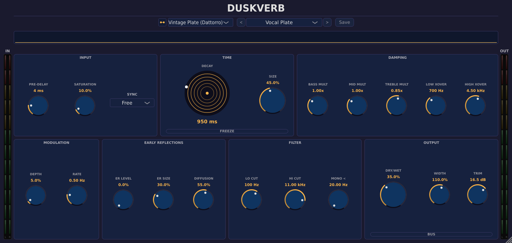
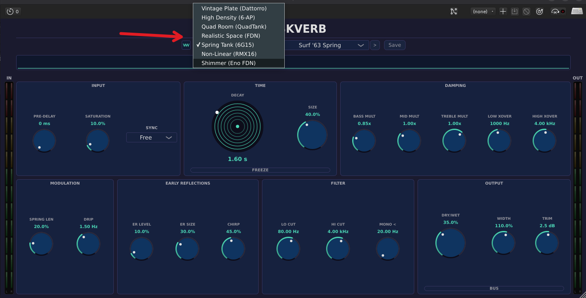
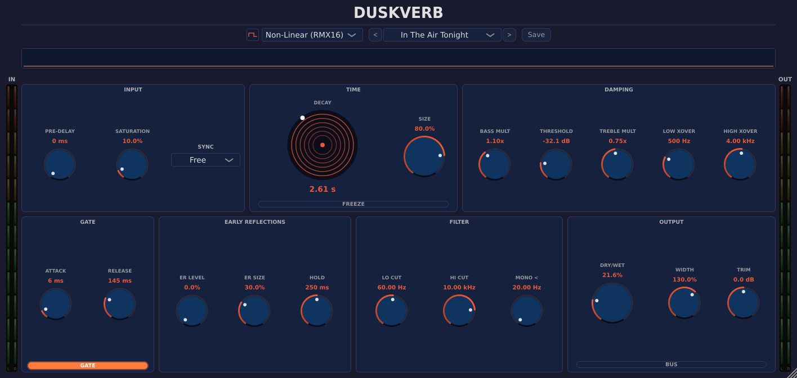
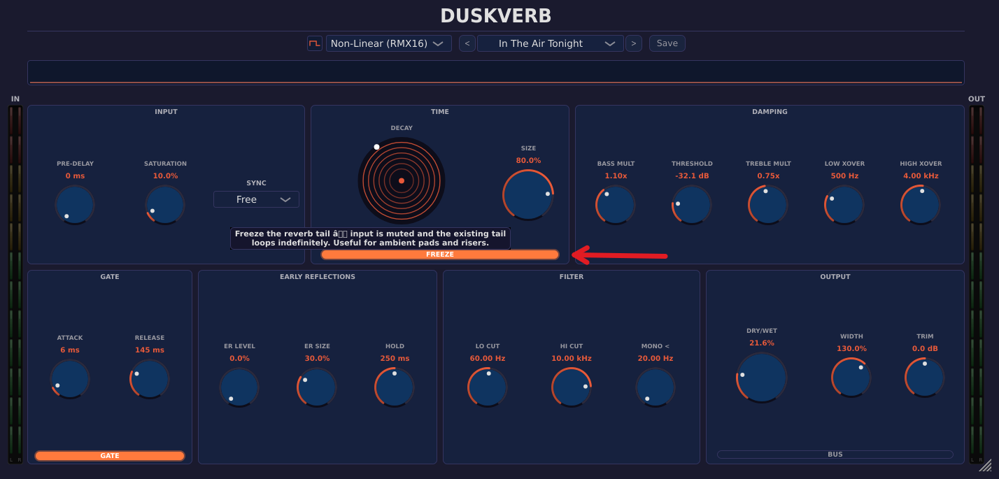
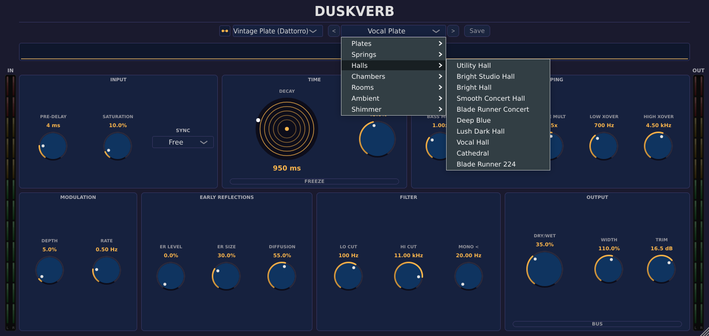

# DuskVerb

> **Pre-release.** DuskVerb is currently in pre-release status. Parameter ranges, preset names, and engine behavior may change before the 1.0 release. This manual reflects the current 0.5.x line; check the website for updates if you are reading an older copy.

## Overview

DuskVerb is an algorithmic reverb with six distinct engines under one user interface. Each engine targets a different reverb territory: **Vintage Plate (Dattorro)** captures the classic plate sound; **High Density (6-AP)** is dense and modern; **Quad Room (QuadTank)** is for tight rooms and short ambience; **Realistic Space (FDN)** is the largest, longest, and most realistic; **Spring Tank (6G15)** is the surf-guitar spring sound; **Non-Linear (RMX16)** is the gated 1980s drum sound and other non-natural curves.

Use it where you would use any reverb. Vocals, drums, guitars, and full-mix space all have an engine in DuskVerb that is voiced for them. The 34 factory presets are anchored to specific hardware references (Lexicon 480L, PCM 90, EMT 140, Bricasti M7, AMS RMX16, others) and serve both as starting points and as a tutorial in what each engine can do.

It is not a convolution reverb (use Convolution Reverb for IR-based work), and it is not a delay/multitap effect. It is a six-in-one algorithmic reverb that lets you pick the right engine for the job.

## Quick Start

1. Insert DuskVerb on a return bus or directly on a track. For most workflows, an aux/return at 100% wet is the cleanest setup.
2. Pick an **Algorithm** from the top dropdown. If you are not sure, start with **Vintage Plate (Dattorro)**; it works on almost everything.

3. Open the preset menu. Each engine has its own preset list. Pick one that matches your source (Vocal Plate for vocals, Tight Drum Room for drums, etc.).
4. Adjust **Decay Time** to taste. The preset gives you a starting point; longer decays sustain more, shorter decays sit more discreetly.
5. Use **Pre-Delay** (0 to 250 ms) to push the reverb tail later, which keeps the dry signal forward and the reverb perceived as space rather than smear.
6. The **Dry/Wet** knob controls the mix. On a return bus, leave at 100%. On an insert, dial back to 20-40% wet.

You should hear a tail when you stop the source. If the tail is too dark, raise **Treble Multiply**; too bright, lower it. If the tail rings or sounds metallic, drop **Diffusion** below the preset value or pick a different engine.

## Workflows

### Vocal plate on a lead vocal

**Source:** A lead vocal that needs space without sounding wet.
**Goal:** Smooth, classic plate tail that thickens the vocal without obscuring it.

Settings (or load the **Vocal Plate** preset and tweak from there):

- **Algorithm:** Vintage Plate (Dattorro)
- **Decay Time:** 1.8 s
- **Pre-Delay:** 30 ms
- **Size:** 0.6
- **Mod Depth:** 0.15
- **Mod Rate:** 1.0 Hz
- **Treble Multiply:** 0.8 (slight high-frequency rolloff in the tail)
- **Lo Cut:** 200 Hz (keeps the tail out of the bass range)
- **Hi Cut:** 8000 Hz
- **Dry/Wet:** 100% (use as a send return)

Why this works. Plate reverbs are dense from the first reflection; they do not have audible early reflections. Pre-delay of 30 ms separates the tail from the dry signal so the vocal stays forward. Lo Cut at 200 Hz prevents the tail from muddying the low end. Subtle modulation (depth 0.15, rate 1 Hz) keeps the plate from sounding static. The 1.8-second decay is a typical pop-vocal length.

### Tight drum room

**Source:** Drum bus or a snare track that needs room without long tail.
**Goal:** Short, punchy ambience that adds size without smearing transients.

Settings:

- **Algorithm:** Quad Room (QuadTank)
- **Decay Time:** 0.6 s
- **Pre-Delay:** 0 ms
- **Size:** 0.4
- **Diffusion:** 0.5 (less than fully diffuse keeps transients distinct)
- **Early Ref Level:** 0.7 (early reflections are most of what you hear)
- **Treble Multiply:** 0.95 (keep highs in the room)
- **Lo Cut:** 80 Hz
- **Dry/Wet:** 25% (insert) or 100% on a return

Why this works. Short decay plus low diffusion plus prominent early reflections gives a "room" sound rather than a "reverb" sound. The drums still hit hard; the room just adds a bit of three-dimensional space. The "Tight Drum Room" preset uses these proportions.

### Realistic concert hall on piano

**Source:** Solo piano or piano in a sparse mix.
**Goal:** A long, lush hall tail that sounds like a real space.

Settings (or use the **Smooth Concert Hall** preset):

- **Algorithm:** Realistic Space (FDN)
- **Decay Time:** 4.5 s
- **Pre-Delay:** 60 ms
- **Size:** 0.85
- **Diffusion:** 0.85
- **Early Ref Level:** 0.4
- **Early Ref Size:** 0.7
- **Bass Multiply:** 1.2 (emphasize the low frequencies in the tail, characteristic of large rooms)
- **Mid Multiply:** 1.0
- **Treble Multiply:** 0.7 (concert halls absorb highs)
- **Lo Cut:** 60 Hz
- **Hi Cut:** 12000 Hz
- **Dry/Wet:** 100% on a return at -10 to -6 dB send level

Why this works. The FDN engine produces realistic late reverberation with audible per-frequency decay differences. Bass multiply above 1 emphasizes the long bass tail typical of real halls. Treble multiply below 1 captures the high-frequency absorption you hear in rooms with absorptive surfaces. Long pre-delay (60 ms) maintains piano clarity.

### Gated 80s snare

**Source:** Snare drum that needs the classic 1980s gated sound.
**Goal:** A non-natural reverb shape that cuts off after a fixed time.

Settings:

- **Algorithm:** Non-Linear (RMX16)
- **Decay Time:** 1.2 s (the gate length, not natural decay)
- **Pre-Delay:** 0 ms
- **Size:** 0.6
- **Treble Multiply:** 1.0
- **Gate:** Enabled (default; this is the parameter that makes the engine non-linear)
- **Dry/Wet:** 35% (insert)

Why this works. The Non-Linear engine in this mode mimics the AMS RMX16's "Non-Lin 2" algorithm: the reverb has constant level for a fixed time (set by Decay Time) and then cuts to silence rather than fading naturally. This produces the 1980s snare sound that defined a decade of records. The "Snare Plate XL" preset is plate-based; for true gated character, switch to Non-Linear.

## Parameter Reference

### Algorithm

- **Algorithm:** Selects which DSP engine processes the audio. Six choices: Vintage Plate (Dattorro), High Density (6-AP), Quad Room (QuadTank), Realistic Space (FDN), Spring Tank (6G15), Non-Linear (RMX16). Switching engines crossfades over a few hundred milliseconds.

### Mix and routing

- **Dry/Wet:** 0 to 100%. Wet/dry mix at the plugin output. 100% on returns; lower on inserts.
- **Bus Mode:** On or off. When on, the plugin assumes a 100% wet send/return setup and bypasses the dry path entirely (slight CPU savings).
- **Bypass:** Reports zero latency to the host while bypassed.

### Time and size

- **Pre-Delay:** 0 to 250 ms. Delay before the reverb tail begins. Longer pre-delay separates the dry signal from the reverb.
- **Pre-Delay Sync:** Free, 1/32, 1/16, 1/8, 1/4, 1/2, 1/1. When set to a note value, pre-delay locks to the host tempo.
- **Decay Time:** 0.2 to 30 s. Total tail length. Different engines interpret this differently; the FDN engine reaches the highest decays; the Non-Linear engine treats this as a gate length.
- **Size:** 0 to 1. Perceived room size. Engine-dependent: in Quad Room, low values are cabinet-sized and high values are arena-sized.

### Modulation

- **Mod Depth:** 0 to 1. Amount of pitch modulation in the tail. Subtle values (0.1 to 0.2) keep the tail moving; high values (0.5 plus) produce chorus-like effects.
- **Mod Rate:** 0.1 to 10 Hz. Speed of the modulation. Slower rates (around 0.5 Hz) sound natural; faster rates produce flanger-like motion.

### Frequency shaping

- **Bass Multiply:** 0.3 to 2.5. Decay-time multiplier for low frequencies. Above 1 makes the bass decay longer than the rest (typical of large halls). Below 1 shortens the bass tail (typical of small studios with absorbers).
- **Mid Multiply:** 0.3 to 2.5. Decay multiplier for the mid range.
- **Treble Multiply:** 0.1 to 1.5. Decay multiplier for the high frequencies. Below 1 produces high-frequency damping (the "warm" tail).
- **Low Crossover:** 200 to 4000 Hz. Frequency where Bass Multiply gives way to Mid Multiply.
- **High Crossover:** 1000 to 12000 Hz. Frequency where Mid Multiply gives way to Treble Multiply.
- **Lo Cut / Hi Cut:** Filters the input into the reverb. Lo Cut keeps low frequencies dry; Hi Cut keeps highs dry. Useful for keeping the reverb out of the kick and the air bands respectively.

### Color and density

- **Saturation:** 0 to 1. Drives a soft saturation stage in the reverb feedback path. Adds warmth and harmonic content.
- **Diffusion:** 0 to 1. Density of the reverb tail. High diffusion is dense and smooth; low diffusion sounds grainier and more echo-like.
- **Early Ref Level:** 0 to 1. How loud the early reflections are relative to the main tail.
- **Early Ref Size:** 0 to 1. The simulated room size for the early reflections.

### Output and stereo

- **Width:** 0 to 2. Stereo width of the reverb output. 1 is unity; 2 is double-wide (M/S based).
- **Freeze:** Off or On. When on, the reverb tail cycles infinitely.
- **Gate:** Off or On. Enables the Non-Linear engine's gating behavior.
- **Mono Below:** 20 to 300 Hz. Frequencies below this cutoff are summed to mono in the reverb output. Default 20 Hz (effectively bypass); typical settings 80 to 150 Hz to keep low-frequency reverb mono-compatible.
- **Gain Trim:** -48 to +48 dB. Final output level adjustment.

## Tips and Traps

- **Pre-Delay is your most important parameter for clarity.** Without pre-delay, the reverb tail starts on the same sample as the dry signal and the result smears. 20 to 60 ms of pre-delay keeps vocals and drums distinct from their reverb.
- **Hardware anchors are real.** The presets are tuned to specific hardware references. "Vintage Vocal Plate" is anchored to the EMT 140; "Blade Runner Concert" to the Lexicon 224; "Cathedral" to a long Lex 480L hall. If you are familiar with the source hardware, the preset name tells you what to expect.
- **Engine switching is not parameter-preserving.** Each engine has its own internal state. Switching engines while a tail is decaying produces a crossfade; do not expect identical-sounding results across engines at the same parameter values.
- **Freeze is loud.** Freeze captures the current reverb tail and loops it indefinitely. Levels can build dramatically; pull Gain Trim back before enabling Freeze on a busy mix.

- **Mono Below preserves bass mono compatibility.** Stereo reverb on bass frequencies often phases on mono fold-down. Set Mono Below to 80 to 120 Hz on mastering or mix-bus reverb.
- **The Non-Linear engine treats Decay Time as a gate length.** It does not behave like other engines for that parameter. Refer to the gated-snare workflow above.

## Presets Explained

DuskVerb ships with 34 factory presets across 7 categories. Each is hardware-anchored and serves as a starting point.

### Plates

Six plate presets ranging from short and bright (**Vocal Plate**, anchored to PCM 90 P2 1.0) to long and lush (**Gold Plate**, PCM 90 P2 0.2). **Vintage Vocal Plate** is the EMT 140 anchor for darker, steely plate character. **Snare Plate XL** is the long plate sound that helped define 1980s snare reverb on records.

### Halls

Eleven halls, from utility (**Utility Hall**, PCM 90 P0 2.9) through bright studio (**Bright Hall**, PCM 90 P0 2.8) to lush concert (**Smooth Concert Hall**, Lex 480L Smooth Hall) to massive cathedral (**Cathedral**, Lex 224 Concert Hall A 6.5 s). **Blade Runner 224** and **Blade Runner Concert** capture the long-decay extended-tail Lex 224 sound. **Lush Dark Hall** is the Lex 480L Hall A warm-dark variant. Pick by length and brightness.

### Rooms

Five rooms covering tight (**Tight Drum Room**) through medium (**PCM Drum Room**, **Studio Room**) to atmospheric (**Reverse Taps**, **In The Air Tonight** for the Phil Collins gated drum effect). Use **Tight Drum Room** as your default for drum bus ambience.

### Chambers

**Realistic Chamber** captures a typical studio chamber sound; longer than a room but shorter than a hall.

### Springs

**Surf '63 Spring** is the Dick Dale "Misirlou" reverb; aggressive, bouncy. **Tank Drip** is a shorter spring tank for subtler surf and reggae work.

### Ambient

Four ambient presets: **Black Hole** (Eventide-anchored), **Infinite Blackhole** (huge sustaining ambience), **Mobius Pad** (Strymon-anchored), **Ambient Swell**. Use these for sound design and pad-like effects rather than realistic space.

### Shimmer

**Cascading Heaven**, **Deep Blue Day** (the Brian Eno track that the engine is named after). Currently the Shimmer engine is hidden in the dropdown but the presets remain accessible. Re-enabled for 1.0.

## Troubleshooting

**The tail sounds metallic or rings.** Drop **Diffusion** to around 0.5 to 0.7 if the tail is buzzing or sounds like a ring modulator. Try a different engine; the FDN engine is the smoothest at long decays, the Vintage Plate engine is naturally more dense.

**The reverb is too loud at low frequencies.** Raise **Lo Cut** to 100 to 200 Hz so the reverb input is high-passed before reaching the engine. Bass frequencies in reverb tails build up quickly and muddy a mix.

**Switching engines drops the tail.** That is intentional. Each engine has its own internal state; the crossfade between engines is brief (a few hundred milliseconds) and the new engine starts with a clean tail. Plan engine switches between sections, not within a phrase.

**The sound is the same regardless of which preset I load.** Confirm you are loading from the **Preset** menu and not just changing the **Algorithm**. Loading a preset sets all parameters including the algorithm; changing only the algorithm leaves the other parameters at their previous values.

**My host shows extra latency on insert.** DuskVerb has a small fixed latency from its early-reflection delay line. The host applies plug-in delay compensation automatically; check that PDC is enabled in your DAW preferences if other tracks sound out of sync.
