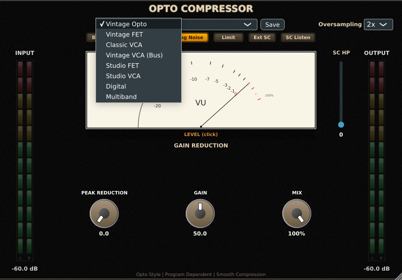
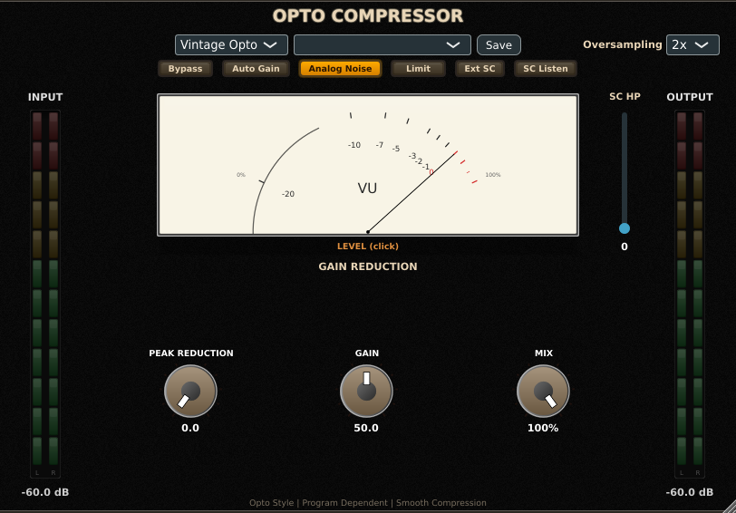
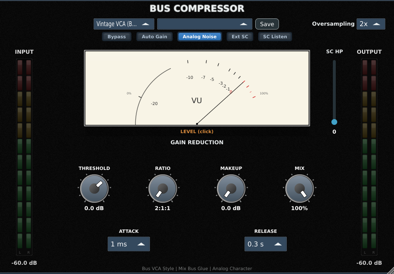
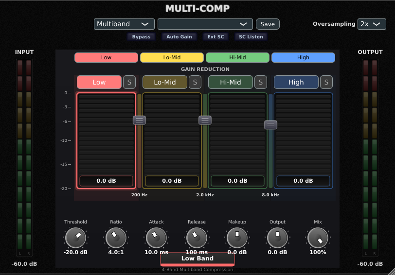
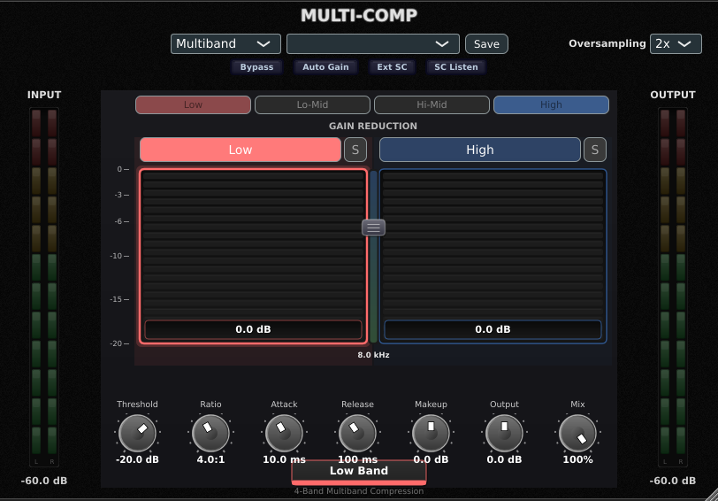
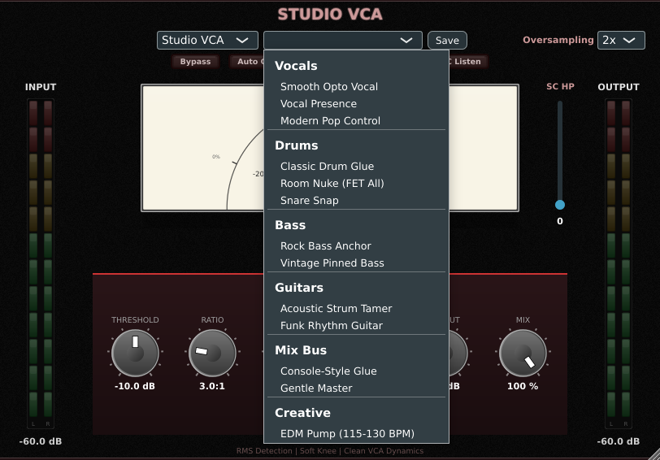

# Multi-Comp

## Overview

Multi-Comp is a single plugin that switches between eight different compressor flavors plus a four-band multiband. Each mode emulates a distinct hardware design, with its own attack and release behavior, knee shape, and saturation character. The eight modes are Vintage Opto, Vintage FET, Classic VCA, Vintage VCA (Bus), Studio FET, Studio VCA, Digital, and Multiband.

Use it the way you would use any compressor: control dynamic range, glue a bus, tame transients, add audible color. The mode you pick determines how it sounds doing those jobs. Vintage Opto and Vintage FET lean into their character; Studio FET, Studio VCA, and Digital stay out of the way; Vintage VCA (Bus) is purpose-built for mix-bus glue; Multiband splits the signal so you can compress problem frequencies without touching the rest.

Multi-Comp is not a transparent peak limiter (use Digital mode with a low ratio if you need that), and it is not a creative effect plugin (use the Creative preset for the closest thing to one). It is a working compressor that covers most of what a mixing engineer reaches for.

## Quick Start

1. Drop Multi-Comp on a track that needs dynamic control. Vocals, bass, and drum bus are good first targets.
2. Set the **Mode** dropdown at the top. If you do not know which mode to pick, start with **Vintage Opto** for vocals and bass, **Classic VCA** for drums, **Vintage VCA (Bus)** for the mix bus.

3. Pull the **Threshold** (or **Peak Reduction** in Opto mode) until you see 3 to 6 dB of gain reduction on the meter. The meter sits to the right of the mode-specific controls.
4. Set **Ratio** to 4:1 for most sources. Ratios above 8:1 are limiting territory.
5. Listen. If the compression sounds choked, lengthen the **Release** (or pick a slower release time on Bus mode). If it sounds soft and lazy, shorten the **Attack**.
6. Use the global **Mix** knob (top of the plugin) to dial in parallel compression. 100% is fully compressed; pulling toward 0% blends the dry signal back in.

You should hear the loud parts come down in level while the quiet parts stay where they are. If you hear pumping on bass-heavy material, raise **SC HP Filter** to 80 to 120 Hz so the compressor stops reacting to the kick fundamental.

## Workflows

### Lead vocal with Vintage Opto

**Source:** A pop or rock lead vocal, recorded around -18 dBFS RMS with peaks near -6 dBFS.
**Goal:** Even level across the verse and chorus, no audible pumping, the singer still feels alive.

Settings:

- **Mode:** Vintage Opto
- **Peak Reduction:** 50% (this is the sweet spot on the hardware)
- **Gain:** start at 50% (unity), raise to taste once compression is dialed in
- **Limit Mode:** Off
- **SC HP Filter:** 60 Hz
- **Mix:** 100%

Why this works. Vintage Opto's optical cell has a program-dependent attack and release, so it does not need you to tune times. It naturally rides level on a vocal. Peak Reduction at 50% gives 4 to 6 dB of gain reduction on a typical lead. The 60 Hz sidechain HP keeps low-frequency rumble from triggering the compressor.

If the vocal still feels uneven, push Peak Reduction toward 70%. If it starts breathing or pumping, drop to 35%.

### Drum bus glue with Vintage VCA (Bus)

**Source:** Stereo drum bus with kick, snare, hats, and overheads, summed at around -10 dBFS peak.
**Goal:** A cohesive drum kit with the kick and snare punching through, gentle level riding on busy fills.

Settings:

- **Mode:** Vintage VCA (Bus)
- **Threshold:** -15 dB
- **Ratio:** 4:1
- **Attack:** 30 ms (the slowest setting)
- **Release:** Auto
- **Makeup:** 3 dB
- **SC HP Filter:** 90 Hz
- **Bus Mix:** 100%

Why this works. The slowest attack (30 ms) lets the kick and snare transients pass through before the compressor clamps down, which is what makes the drums punch. Auto release adapts to the program material so you do not get pumping on busy passages. The 90 Hz sidechain HP prevents the kick fundamental from over-driving the compressor on every hit.

This is the configuration behind the "Classic Drum Glue" factory preset. If you want more obvious glue, drop Threshold to -18 dB. For a softer, more transparent version, use Ratio 2:1.

### Snare punch with Classic VCA

**Source:** Single snare track, hit hard, peaks at -3 dBFS.
**Goal:** Tighter snare with the crack preserved.

Settings:

- **Mode:** Classic VCA
- **Threshold:** -18 dB
- **Ratio:** 4:1
- **Attack:** 15 ms
- **Release:** 80 ms
- **Output:** +3 dB
- **Over Easy:** Off

Why this works. 15 ms is slow enough to pass the initial transient (the "crack") and clamp on the body of the hit. Faster attack (5 ms or less) kills the snap and makes the snare sound dull. 80 ms release recovers in time for the next hit at typical rock tempos.

For a softer, less obvious result, turn **Over Easy** on. This switches the knee from hard to soft (around 6 dB wide), so compression eases in instead of slamming.

### De-essing a vocal with Multiband

**Source:** Lead vocal with harsh sibilance in the 6 to 9 kHz range.
**Goal:** Tame the "sss" without dulling the vocal.

Settings:

- **Mode:** Multiband
- Use the **ON** strip toggles to turn off Low, Low-Mid, and Hi-Mid bands. Leave High enabled.
- **Crossover 3:** 6000 Hz (drag the rightmost crossover fader down from 8 kHz)
- **High Threshold:** -28 dB
- **High Ratio:** 6:1
- **High Attack:** 1 ms
- **High Release:** 80 ms
- **MB Mix:** 100%

Why this works. With three bands disabled, the multiband splitter collapses so the High band covers everything from 6 kHz up. A fast attack (1 ms) catches sibilance before it gets loud. Ratio 6:1 is aggressive, but the narrow band limits the audible damage. Watch the High band's gain reduction meter; aim for 4 to 8 dB on the loudest "sss" and near zero on everything else.

This same pattern works for kick mud (enable just the Low band, set Crossover 1 around 150 Hz) and for harsh cymbals (just the High band, Crossover 3 around 8 kHz).

## Parameter Reference

### Global controls (top of the UI)

- **Mode:** Picks the compressor flavor. Eight choices. Mode-specific controls below the dropdown change to match.
- **Bypass:** Reports zero latency to the host while bypassed (no PDC offset on parallel buses).
- **Mix:** 0 to 100%, default 100%. The dry/wet blend at the plugin output. Pull below 100% for parallel compression.
- **Stereo Link:** 0 to 100%, default 100%. How tightly the two channels share gain reduction. 100% means both channels react to the loudest channel; 0% is fully independent (dual mono). Lower values widen perceived stereo on busy material.
- **Link Mode:** Stereo, Mid-Side, or Dual Mono. Mid-Side processes the M and S channels independently; useful for tightening center elements without affecting width.
- **Auto Makeup:** Off or On. When On, automatic level compensation tries to keep output loudness similar to input.
- **SC HP Filter:** 0 to 500 Hz, default 0 (Off). Highpass on the sidechain only (does not affect output). Use 60 to 120 Hz on bass-heavy material to stop low-frequency pumping.
- **Lookahead:** 0 to 10 ms, default 0. Delays the audio by the lookahead time so the detector sees transients before they hit the compressor. Adds latency to the host.
- **Oversampling:** Off, 2x, or 4x, default 2x. Reduces aliasing from the saturation stage. 4x costs about twice the CPU of 2x.
- **External Sidechain:** Off or On. Routes a separate sidechain input from the host (DAW-specific routing required).
- **SC Listen:** Off or On. Sends the sidechain signal to the output for monitoring; turn off before printing.

### Mode-specific notes

- **Vintage Opto:** Peak Reduction (0 to 100%) is the only compression control. Limit Mode toggles between gentle (off) and aggressive (on).
- **Vintage FET:** Ratio is fixed in steps (4:1, 8:1, 12:1, 20:1, All). All-Buttons enables the famous extreme compression with non-linear character; Curve Mode picks Modern (the original algorithm) or Measured (matches hardware capture). Transient (0 to 100%) blends raw transient through the compressor.
- **Classic VCA:** Wide threshold range (-38 to +12 dB) and ratio up to 120:1 (limiting). Over Easy switches to soft knee.
- **Vintage VCA (Bus):** Discrete attack (0.1, 0.3, 1, 3, 10, 30 ms) and release (0.1, 0.3, 0.6, 1.2 s, Auto). 30 ms attack plus Auto release is the classic glue setting.
- **Studio FET:** Same control set as Vintage FET but voiced cleaner with less harmonic content.
- **Studio VCA:** Continuous controls, ratio up to 10:1, voiced for transparent dynamics work.
- **Digital:** Continuous everything, with adjustable Knee width (0 to 20 dB) and Adaptive Release (program-dependent). Use this when you want precision.
- **Multiband:** Four bands (Low, Lo-Mid, Hi-Mid, High) with three Linkwitz-Riley 4th order crossovers. Each band has its own threshold/ratio/attack/release/makeup, plus solo and ON. Disabling a band collapses the splitter so the band's frequency range merges into the nearest enabled neighbor (a real two-band or three-band layout, not just a bypass).

## Tips and Traps

- **Auto Makeup hides level changes.** When you compare presets or A/B settings, Auto Makeup can mask whether you actually like the compression or just the level boost. Turn it off when auditioning.
- **Oversampling costs CPU.** 2x is the default and is plenty for most material. Drop to Off for tracking; raise to 4x only on a final mix bus where the saturation is doing audible work.
- **Mode switching does not preserve compression amount.** Each mode has its own threshold scale (Opto's Peak Reduction at 50% is not the same as Digital's threshold at -20 dB). Re-set the compression amount when you switch modes.
- **Lookahead adds latency.** The host applies plug-in delay compensation (PDC), so your other tracks stay aligned, but live monitoring through the plugin will sound late. Bypass during tracking.
- **Multiband bands cannot drop below two enabled.** The plugin enforces a minimum of two active bands. Trying to disable a third band locks the toggle.
- **The Bus Compressor's "Auto" release is the magic setting** for glue. If you can't hear the difference between Auto and 0.6 s, listen during a sparse-to-busy transition; that's where Auto earns its keep.

## Presets Explained

Multi-Comp ships with 13 factory presets across six categories. Each is a starting point, not a finished sound; expect to nudge threshold and makeup once it is on your source.

### Vocals

- **Smooth Opto Vocal.** Vintage Opto, Peak Reduction 50%, SC HP at 60 Hz. The classic optical vocal sound; reach for this on a lead vocal that needs level control without character changes.
- **Vocal Presence.** Vintage FET, Ratio 4:1, fast attack (~0.5 ms), 60 ms release, SC HP at 100 Hz. Adds the FET-style aggression and presence; good for rock and indie vocals where you want the compressor heard.
- **Modern Pop Control.** Studio FET, Ratio 8:1, very fast attack (0.3 ms), 120 ms release, Auto Makeup on. Tight, transparent peak control for pop and contemporary genres.

### Drums

- **Classic Drum Glue.** Vintage VCA (Bus), Ratio 4:1, 30 ms attack, Auto release, SC HP at 90 Hz. The standard drum-bus setting; let the kick and snare punch through, glue the rest.
- **Room Nuke (FET All).** Vintage FET with All-Buttons mode, threshold -24 dB, slightly slower attack to develop the famous plateau. Use on parallel room mics for the smashed-room effect; not a primary compressor.
- **Snare Snap.** Classic VCA, Ratio 4:1, 15 ms attack, lets the snare crack pass before clamping. Apply per-snare, not on the bus.

### Bass

- **Rock Bass Anchor.** Vintage FET with a slower attack to keep sub frequencies clean.
- **Vintage Pinned Bass.** Vintage Opto with maximum Peak Reduction for the classic Motown "pinned" feel.

### Guitars

- **Acoustic Strum Tamer.** Classic VCA with a fast attack to control strumming spikes.
- **Funk Rhythm Guitar.** Vintage FET with a fast release; emphasizes the "up" stroke.

### Mix Bus

- **Console-Style Glue.** The 4:1, 10 ms attack, Auto release, 4 dB GR setting; the canonical mix-bus compressor sound.
- **Gentle Master.** Studio VCA at Ratio 1.5:1; a low-ratio, modern mastering-bus starting point.

### Creative

- **EDM Pump (115-130 BPM).** Heavy compression with a release tuned to quarter notes in the 115 to 130 BPM range; the "side-chain pump" effect without an actual sidechain.

## Troubleshooting

**I hear nothing.** Check the Bypass button at the top, check Mix is not at 0%, and confirm your DAW track output is not muted. If on Multiband mode, the GR meter shows the loudest band; if all bands show zero GR even on a loud signal, your Threshold is set above the input level.

**The compressor is pumping on bass-heavy material.** Raise SC HP Filter to 80 to 120 Hz. The detector stops reacting to the kick fundamental.

**The CPU usage is high.** Drop Oversampling from 4x to 2x or Off. Disable True Peak detection if it is on (it adds a 4x or 8x detector path). Multiband at 4x oversampling on a busy bus is the worst-case combination.

**The audio sounds late through the plugin.** Lookahead and Digital mode's internal lookahead both delay output. Your host applies PDC for playback alignment, but live monitoring is still delayed. Bypass during tracking.

**The mode dropdown changes my sound dramatically.** That is intentional. Each mode has its own threshold scale, attack and release behavior, and saturation profile. After switching, re-set the compression amount on the new mode's controls.
