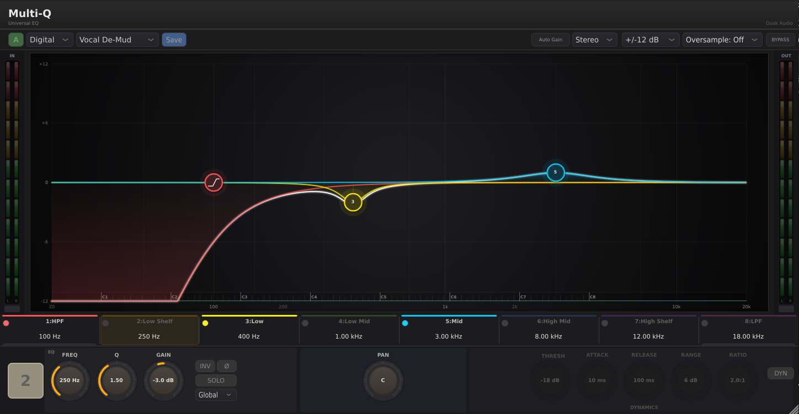
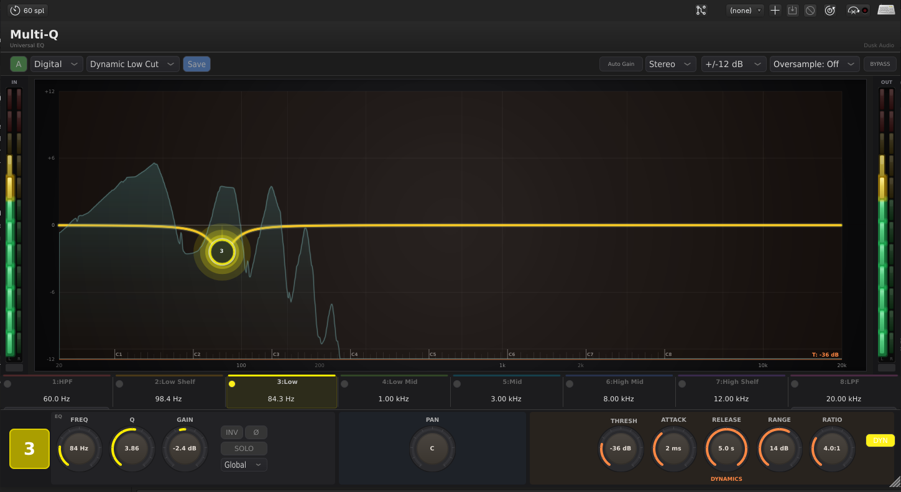
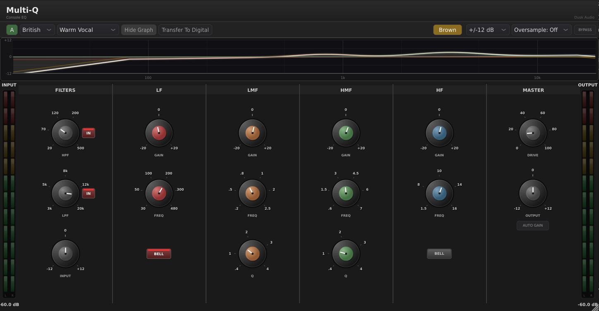
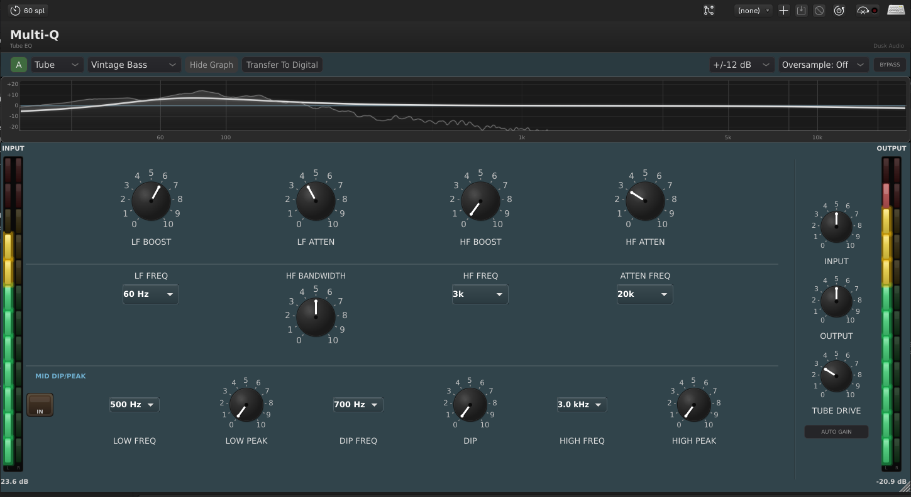
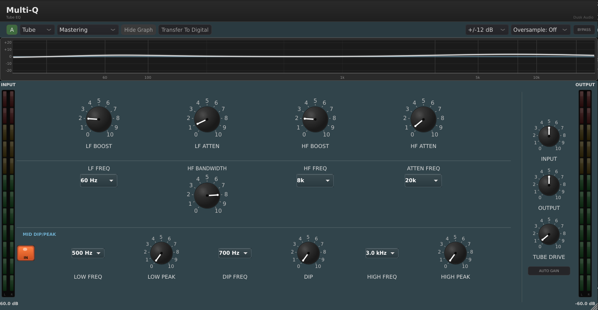

# Multi-Q

## Overview

Multi-Q is three EQs in one plugin. The mode switch at the top picks between **Digital** (an 8-band parametric with per-band dynamic EQ), **British** (a four-band console EQ with Brown and Black character options), and **Tube** (a vintage passive tube-style EQ with the classic "boost and cut at the same frequency" interaction). Each mode is voiced and operated differently; switching modes is a creative choice as much as a workflow choice.

Use Digital for surgical work and dynamic frequency control. Use British for tonal shaping with console color (it is the same engine as 4K-EQ, integrated). Use Tube for vintage warmth and the unique passive-EQ curves that interact between bands. The real-time spectrum analyzer above the curve display works across all three modes.

It is not a corrective de-noise tool, and it is not a mastering limiter; pair it with a compressor or limiter for level work. It is a clean, capable EQ that swaps personalities at will.

## Quick Start

1. Insert Multi-Q on the source you want to shape. Pick a mode at the top: **Digital**, **British**, or **Tube**.
2. The main display shows your EQ curve overlaid on a real-time spectrum. Click and drag a band's control point to set frequency (horizontal) and gain (vertical).
3. Mouse-wheel over a control point to adjust Q (band width).
4. Right-click a control point for band-specific options (filter shape, dynamic EQ activation in Digital mode, Brown/Black switch in British mode).
5. Use the **Bypass** button to A/B against unprocessed audio.
6. The **A/B** preset slots at the top let you compare two settings: load Multi-Q, set up your EQ on slot A, click **B** to switch to a fresh slot, build a different EQ, then toggle between A and B by clicking the letter.

You should hear the source change tonal balance immediately. If the band you are dragging produces no audible change, check the Q (very high Q with low gain is nearly inaudible) and confirm the band is enabled (in Digital mode, the band-strip toggles below the curve let you disable individual bands).

## Workflows

### Digital mode: surgical resonance notch

**Source:** A snare drum with a ringy 380 Hz resonance.
**Goal:** Remove the ring without dulling the snare.

Settings:

- **Mode:** Digital
- Choose any unused parametric band. Drag its control point to 380 Hz.
- **Filter shape:** Bell (default for parametrics)
- **Gain:** -8 dB
- **Q:** 6 (narrow)

Why this works. A narrow bell at the offending frequency cuts only the resonance and leaves the rest of the snare unchanged. To find the exact frequency, set Gain to +8 dB temporarily, sweep the band's frequency, and listen for where the ringing gets worse; that is your target. Then flip Gain to -8 dB.

For an even more surgical version, switch the band's filter shape to **Notch** (right-click). A notch is sharper than a high-Q bell and removes the resonance entirely.

### Digital mode: dynamic de-essing

**Source:** A vocal with sibilance peaks in the 6 to 8 kHz range.
**Goal:** Reduce the sibilance only when it gets loud, leave the rest of the vocal alone.

Settings:

- **Mode:** Digital
- Pick the High Shelf band or any parametric band. Drag to 7000 Hz.
- **Filter shape:** Bell
- **Gain:** 0 dB (the static cut is zero; dynamics will do the work)
- **Q:** 1.5

Right-click the band to access **Dynamic EQ** controls:

- **Threshold:** -28 dB
- **Range:** -8 dB (max cut applied when threshold is exceeded)
- **Attack:** 1 ms
- **Release:** 80 ms

Why this works. The static gain stays at 0, so non-sibilant content passes through untouched. When sibilance pushes the band's energy above -28 dB, the dynamic EQ cuts up to 8 dB at that frequency. Fast attack catches the transient; release back to zero in 80 ms. The "Multiband De-Ess" factory preset uses this approach.

### British mode: vocal sweetening with console character

**Source:** A lead vocal that needs presence and warmth without surgical cuts.
**Goal:** Tonal balance with audible analog character.

Settings:

- **Mode:** British
- **EQ Type:** Brown (E-series) for the warmer character
- **HPF:** On, 80 Hz (cleans up rumble)
- **LF Gain:** -3 dB at 300 Hz, Bell mode
- **HM Gain:** +4 dB at 3500 Hz, Q 0.7
- **HF Gain:** +2 dB at 8000 Hz, Shelf
- **Saturation:** 15%

Why this works. British mode in Multi-Q runs the same engine as 4K-EQ, so the "Vocal Presence" approach from 4K-EQ applies directly. The 300 Hz cut clears boxiness, the 3.5 kHz boost adds intelligibility, the 8 kHz shelf adds air. Saturation at 15% adds the slight harmonic content that makes a vocal sit in a mix without surgical work. For a more aggressive character, switch to Black mode.

### Tube mode: vintage bass with the boost-and-cut trick

**Source:** Bass guitar that needs both fullness and clarity.
**Goal:** Add low-frequency body and tighten the muddy lower-mids.

Settings:

- **Mode:** Tube
- **LF Boost:** 60 Hz, +4 dB
- **LF Attenuation:** 60 Hz, +3 dB (boost AND cut at the same frequency)
- **HF Boost:** 5000 Hz, +2 dB
- **Tube Drive:** 25%

Why this works. The vintage passive EQ trick is to boost and cut at the same low frequency. The interaction of the two passive curves creates a unique shape: more energy at the boost peak (around 60 Hz) AND a slight dip just above it (where the boost rolls off and the cut kicks in). The result is a punchy low end that does not muddy the mids. Tube Drive at 25% adds the harmonic warmth of the simulated 12AX7 stage.

This is not a digital trick; it mimics how real passive tube EQs behave. The "Vintage Bass Trick" factory preset shows this exact approach.

## Parameter Reference

### Mode-independent (always visible)

- **Mode:** Digital, British, or Tube. Each mode has its own parameter set; the visible controls change when you switch.
- **Bypass:** Reports zero latency to the host while bypassed.
- **Output Gain:** Final makeup gain.
- **Auto Gain Compensation:** Keeps output level matched to input as you boost and cut.
- **Spectrum Analyzer Pre/Post:** Pre shows the input signal; Post shows the EQ output.
- **Oversampling:** 2x or 4x. Reduces aliasing in saturation stages (British and Tube modes).
- **A/B Slots:** Two complete parameter snapshots accessible from the top toolbar. Useful for comparing two different EQ approaches on the same source.

### Digital mode

8 fully parametric bands (HPF at the low end, Low Shelf, four mid parametrics named Low / Lo-Mid / Mid / Hi-Mid, High Shelf, LPF at the high end). Each band has:

- **Frequency:** 20 Hz to 20 kHz (range varies by band).
- **Gain:** -24 to +24 dB.
- **Q:** 0.1 to 36 (effectively notch-narrow at the high end).
- **Filter shape:** Bell, Shelf, Pass, Notch, or Band Pass (choices vary by band).
- **Enabled:** Per-band toggle in the strip below the curve.
- **Dynamic EQ:** Threshold (-60 to 0 dB), Attack (0.1 to 100 ms), Release (10 to 1000 ms), Range (-24 to +24 dB). Right-click a band to expand the dynamic controls.

The HPF and LPF have selectable slopes (12, 18, or 24 dB/oct). The mid parametrics support Notch and Band Pass shapes for surgical work.

### British mode

Same controls as 4K-EQ:

- **HPF / LPF:** Frequency and enabled toggles.
- **Four bands** (LF, LM, HM, HF): gain, frequency, Q (LM/HM only); LF and HF have Bell/Shelf switches.
- **EQ Type:** Brown or Black.
- **Saturation:** 0 to 100%.
- **M/S Mode:** Off or On.

See the 4K-EQ chapter for detailed parameter notes; the engine is identical.

### Tube mode

- **LF Boost:** Frequency selectable (typically 20, 30, 60, 100 Hz), gain 0 to +12 dB.
- **LF Attenuation:** Frequency selectable, gain 0 to +12 dB (cut amount; passive design).
- **HF Boost:** Frequency selectable (3, 5, 10, 16 kHz), gain 0 to +12 dB, with **Bandwidth** control (broad or narrow).
- **HF Attenuation:** Frequency selectable, gain 0 to +12 dB.
- **Mid Dip / Peak:** A center-frequency band with selectable curve shape; useful for vocal presence shaping.
- **Tube Drive:** 0 to 100%. Drives the simulated 12AX7 triode stage. 0 is clean; 30 to 50% adds audible second-harmonic warmth.

Boost and Attenuation at the same frequency interact in the passive style: the curve becomes neither pure boost nor pure cut but a unique interaction shape.

## Tips and Traps

- **Modes do not share band settings.** A 4 kHz boost in Digital mode is not present when you switch to British, even though the curves of both can pass through 4 kHz. Each mode has its own parameter set; the mode switch is a hard switch, not a re-mapping.
- **Right-click for hidden options.** Filter shape, dynamic EQ, M/S routing per-band, all live in the right-click menu. Beginners often miss them and miss half the plugin's capability as a result.
- **The boost-and-cut trick is mode-specific.** Only Tube mode has that interaction. In Digital or British modes, boosting and cutting at the same frequency cancels out (or nearly so).
- **A/B is your friend on long EQ sessions.** Set A as your starting point. Build B to compare. If neither sounds right, click A again to reset. The A/B slots are persistent within the session; they do not save with presets.
- **British mode shares the 4K-EQ engine.** Settings and behavior are identical. If you have a 4K-EQ preset you like, you can recreate it in Multi-Q's British mode by hand.
- **The spectrum analyzer is a guide, not a sound.** Pre/Post toggle shows you what changed; do not let the pretty curve trick you. Listen first, look at the spectrum to confirm.

## Presets Explained

Multi-Q ships with around 50 factory presets across roughly 8 categories. They are organized by source (Vocals, Drums, Guitars, Bass, Mix Bus), by mode (each mode contributes presets), and by use case (Mastering, Creative, Dynamic, M/S). Listing every one would balloon this manual; instead, here are the themes you should know about.

### Vocals presets

Multiple presets across all three modes. Digital-mode "Vocal Presence" uses static EQ for clarity and air. British-mode "Console Vocal Chain" applies the 4K-EQ Vocal Presence approach plus saturation. Tube-mode "Warm Vocal (Tube)" uses LF boost-and-cut for body and Tube Drive for harmonic warmth. Pick by what character you want; all three are valid starting points for a lead vocal.

### Drums presets

Per-source: "Punchy Kick", "Snare Crack", "Overhead Clarity", and "Rock Drums" (a British-mode bus preset). Digital-mode kick presets often pair a low-shelf boost with a narrow mid cut for click. British-mode drum presets add saturation. Tube-mode drum presets are rare; tube character is usually too colored for kit work.

### Mastering presets

"Mastering Surgical" uses Digital with narrow bells; "Mastering Air" lifts the top end with shelves; "Mastering Wide" uses M/S processing for stereo width. "Vintage Air" and "Console Warmth" sit in British and Tube modes respectively for analog flavor on a master.

### Dynamic-EQ presets (Digital mode only)

"Multiband De-Ess" applies dynamic cut at sibilance frequencies. "Dynamic Bass Control" tames bass build-up dynamically. "Resonance Tamer" is a starting point for cutting unwanted resonances that only show up at higher levels. These presets demonstrate per-band dynamic EQ; right-click a band on any of them to see how the dynamics are wired.

### Creative presets

"Telephone Effect" (narrow band-pass for radio voice), "Lo-Fi Warmth" (heavy filtering with British-mode saturation), "Stereo Width" (M/S width tricks). Use these as effects rather than starting points for serious mixing.

### Vintage presets (Tube mode)

"Vintage Bass Trick" demonstrates the boost-and-cut at the same frequency. "Vintage Air" shelves the top end gently. "Warm Vocal (Tube)" combines LF boost-and-cut with Tube Drive. These are the showcases for what Tube mode can do that the other modes cannot.

If you want to study the presets, open one and right-click each band to inspect its settings. The preset names suggest use cases; the band-by-band layout shows the technique.

## Troubleshooting

**The plugin sounds the same in all three modes.** Confirm you are actually switching modes (the curve display changes when you do; the band labels change too). With all bands flat, the difference between modes is only the saturation and the filter topology of any active filters. To hear the difference, boost or cut a band in each mode and compare.

**The spectrum analyzer shows different curves than the EQ shape.** That is intentional. The analyzer shows actual frequency content; the EQ curve shows the filter response. They are different views. Pre/Post toggle on the analyzer compares input to output.

**Right-click does nothing.** On Linux, some hosts intercept right-click for their own menus. Try Ctrl+click or check your host's preferences for plugin context-menu handling.

**My British mode preset sounds different from a 4K-EQ preset with the same settings.** The engines should be identical. The most likely cause is sample-rate handling or auto-gain compensation; confirm both plugins are at the same sample rate and either both have Auto Gain on or both off.
