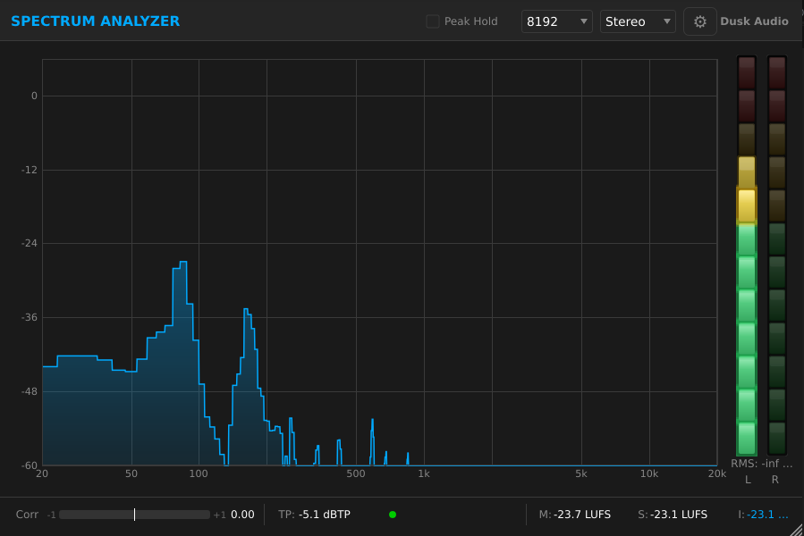
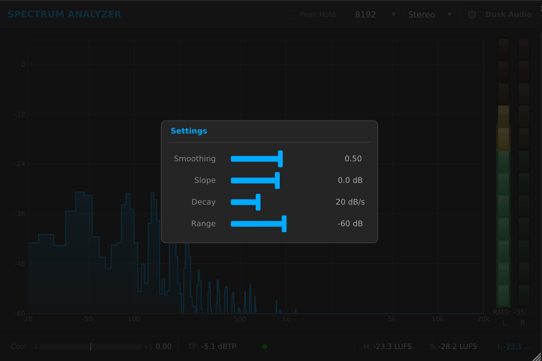
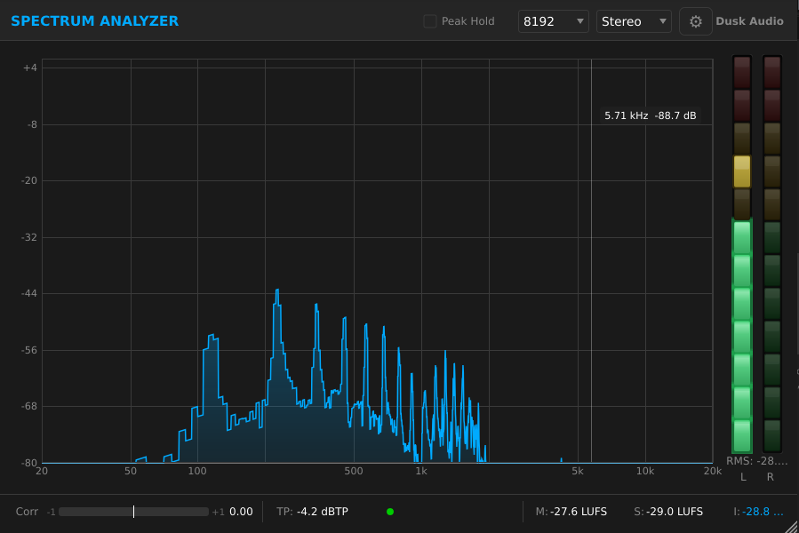
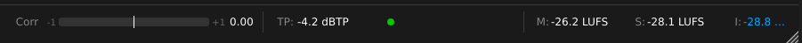

# Spectrum Analyzer

## Overview

Spectrum Analyzer is a measurement plugin, not a sound-shaping plugin. Drop it on any track or bus to see what is actually there: a real-time FFT spectrum, four kinds of loudness reading (Momentary, Short-term, Integrated, LRA), an ITU-R BS.1770-4 compliant true-peak meter, a stereo correlation meter, and K-System headroom display.

Use it to verify what your ears are telling you. The spectrum shows tonal balance and resonance; LUFS shows perceived loudness for streaming-platform targets; true-peak catches inter-sample peaks that a regular sample-peak meter misses; correlation flags phase issues before they cost you a mono fold-down.

It is not a corrective EQ, and it is not a sonic-fingerprint matching tool (use Multi-Q's Match mode for that). It is a precise set of meters that gives you the numbers you need to decide what to do next.

## Quick Start

1. Insert Spectrum Analyzer on the track or bus you want to measure. Mastering bus is a common place to put it; it works equally well on a single instrument.
2. Play the project. The spectrum draws across the main display. Loudness readings appear next to it.
3. Click the gear icon (top right) to open the settings overlay.

 The defaults (4096 FFT, 0.5 smoothing, 0 dB/oct slope, K-14 metering) work for most program material.
4. Look at the Integrated LUFS readout once the section you are checking has played for at least 10 seconds. That is your loudness number.
5. Watch the True Peak indicator. If it lights red, your master is clipping inter-sample; pull the output back at least 1 dB.
6. Use the Channel Mode dropdown in the header to switch between Stereo, Mono, Mid, and Side views.

You should see frequency content where you expect it (kicks under 100 Hz, vocals around 1 to 3 kHz, cymbals above 8 kHz). The correlation bar should sit between 0 and +1 on most material; negative values mean the stereo image is fighting itself.

## Workflows

### Tonal balance check on a mix

**Source:** A near-final mix bus, played at performance level.
**Goal:** Confirm the mix has the spectral shape you intended.

Settings:

- **Channel Mode:** Stereo
- **FFT Resolution:** 4096
- **Slope:** 4.5 dB/oct
- **Smoothing:** 0.7
- **Display Min:** -60 dB
- **Display Max:** +6 dB
- **Peak Hold:** On
- **Peak Hold Time:** 5 sec

Why this works. A 4.5 dB/oct slope tilts the display so a balanced "pink-noise" mix appears roughly flat across the spectrum. With Slope at 0, low end always dominates the visualization and you cannot eyeball mid and high content at a glance. Higher smoothing (0.7) damps out per-frame noise so you see steady tonal shape, not transients. Peak Hold with a 5-second decay shows you the loudest frequencies during the chorus.

Look for: a roughly even hill across 60 Hz to 10 kHz, with a small bump in the kick range (50 to 100 Hz) and a gentle roll-off above 12 kHz. Big resonant spikes (a single peak that sticks 6 dB above its neighbors) usually mean a problem frequency you can fix with a narrow EQ cut.

### Streaming loudness target

**Source:** A finished master, ready to upload.
**Goal:** Confirm Integrated LUFS hits the streaming target (typically -14 LUFS for Spotify and Apple Music, -16 LUFS for podcasts).

Settings:

- **Channel Mode:** Stereo
- **K-System Type:** K-14
- **Display Min:** -60 dB
- **Display Max:** 0 dB
- Other settings: defaults

Why this works. Set Spectrum Analyzer post-fader, post-everything, on the master bus. Play the entire song from start to end without stopping (LUFS Integrated only updates while audio is above the gate threshold; pausing pollutes the reading). The Integrated reading at the end is your loudness number.

If Integrated LUFS reads -10, your master is louder than the streaming target and the platform will turn it down. If it reads -18, you have headroom to push the level up. The True Peak meter must stay at or below -1 dBTP for safe transcoding to lossy formats. Watch the LRA (Loudness Range) reading; for most modern pop and rock, LRA between 5 and 10 LU is typical. Above 15 indicates very dynamic material.

### Mid/Side imaging check

**Source:** A stereo mix that feels "narrow" or "off-center".
**Goal:** Identify what is in the middle versus the sides.

Switch the Channel Mode dropdown between Mid and Side while the mix plays. The spectrum updates to show only that component.

- **Mid mode:** kick, snare, bass, lead vocal, anything panned center.
- **Side mode:** room mics, reverb returns, doubled guitars, anything panned wide.

What to look for. If the Side spectrum has heavy low-frequency content (below 150 Hz), the mix has phasey low end; consider high-passing the side channel or summing low end to mono. If the Mid spectrum shows nothing above 5 kHz, the highs are all in the sides; that can sound airy on speakers but vanishes on mono playback.

### Phase correlation check

**Source:** Anything stereo, especially overhead drum mics, room mics, or stereo synths.
**Goal:** Catch phase issues before mono fold-down loses the signal.

Watch the correlation bar at the top of the meter strip. Positive (green) values mean the channels mostly agree; this is good. Values near zero (yellow) mean stereo content with low correlation; this is fine for ambient material. Values below zero (red) mean the channels are partially out of phase; if you sum to mono, those frequencies cancel.

If you see persistent negative correlation, swap the polarity of one channel of the offending stereo source and check again. Briefly negative values during transients are normal for very wide stereo material.

## Parameter Reference

Spectrum Analyzer has 10 user-facing parameters, all exposed through the settings overlay (gear icon) except Channel Mode which sits in the header. The LUFS, True Peak, and correlation meters are always running and have no parameters of their own.

### Display

- **FFT Resolution:** 2048, 4096 (default), 8192. Higher resolution gives finer low-frequency detail at the cost of slower update rate. 2048 is the most responsive; 8192 reveals individual harmonics down to about 30 Hz. 4096 is the right starting point.
- **Smoothing:** 0.0 to 1.0, default 0.5. Damps the per-frame fluctuations of the spectrum line. 0 is maximally responsive (jittery); 1 is heavily smoothed (sluggish). Use 0.7 to 0.9 for tonal-balance work; 0.2 to 0.4 for catching transient resonances.
- **Slope:** -4.5 to +4.5 dB/oct, default 0.0. Tilts the display. +4.5 makes pink-noise read flat; great for mixing reference. 0 shows the raw spectrum.
- **Decay Rate:** 3 to 60 dB/sec, default 20. How fast the spectrum line falls when audio energy drops. Slower decay (lower number) holds peaks visible longer.
- **Display Min:** -100 to -30 dB, default -60. Bottom of the visible vertical range.
- **Display Max:** 0 to +12 dB, default +6. Top of the visible vertical range.

### Peak Hold

- **Peak Hold:** On / Off, default Off. Overlays a "peak hold" trace that captures the highest level seen at each frequency.
- **Peak Hold Time:** 0.5 to 10 sec, default 2.0. How long the held peaks stay visible before they decay.

### Channel routing

- **Channel Mode:** Stereo, Mono, Mid, or Side. Stereo overlays the L and R spectra; Mono sums both; Mid shows the (L+R)/2 sum; Side shows the (L-R)/2 difference.

### Metering

- **K-System Type:** K-12, K-14 (default), K-20. Sets the reference level for the K-System scale. K-14 is the typical mastering reference; K-20 is broadcast/film; K-12 is loudness-targeted music.

## Tips and Traps

- **Pre-fader vs post-fader matters.** Spectrum Analyzer measures whatever signal reaches it. Insert it pre-fader to measure the source independent of automation; post-fader to measure what the listener hears.
- **LUFS Integrated needs a continuous play.** The Integrated reading uses gating to ignore silence and very-low-level passages. If you stop and start playback, the gate window resets and the reading drifts. Play through the section in one go.
- **True Peak with 4x oversampling is on by default.** This catches inter-sample peaks that a regular sample-peak meter misses. The cost is small CPU; leave it on for mastering.
- **The correlation meter can mislead on quiet sources.** When the signal is below about -50 dBFS, correlation readings get noisy and can swing wildly. Trust correlation only when there is real audio playing.
- **Slope shifts the curve, it does not change the audio.** This is a display setting only. Do not confuse it with an EQ.
- **Mid/Side mode is for monitoring, not for routing.** Switching to Mid does not change the audio leaving the plugin; it changes what the spectrum draws.
- **The plugin does not write to the audio path.** Spectrum Analyzer is a pure analyzer; output equals input regardless of settings.

## Recommended Setups

Spectrum Analyzer does not ship with factory presets, but a few starting-point configurations are worth saving as DAW-level "saved states" or default presets you can recall.

### Mixing reference

Slope 4.5, Smoothing 0.8, Decay 20, FFT 4096, Channel Mode Stereo, Peak Hold on with a 3-second decay. Drop this on the mix bus while building a song; the tilted display lets you eyeball whether the mix is generally balanced or skewing one way.

### Mastering target

Slope 0, Smoothing 0.5, Display Min -100, Display Max 0, K-System K-14, FFT 8192. The longer FFT gives the low-end resolution you need to spot 50/60 Hz hum and sub-bass issues. K-14 is the standard mastering reference scale.

### Imaging analysis

Channel Mode Side, Slope 4.5, Smoothing 0.7. Quickly switches the display to the side component so you can see what is contributing to stereo width. Pair with a second instance set to Mid mode if your DAW supports parallel routing.

### Live tracking

Smoothing 0.2, Decay 40, FFT 2048, Peak Hold off. Maximally responsive setup for catching transients and quick spectral changes during recording. The shorter FFT keeps latency-related drawing artifacts to a minimum.

## Troubleshooting

**The spectrum is completely flat.** No audio is reaching the plugin. Check that you have inserted it in the signal path (not on a return) and that the track is playing. If the signal is very quiet (below -60 dB), it can fall below the bottom of the default display range; lower Display Min to -100 dB.

**LUFS reads -inf or never settles.** Integrated LUFS uses gating; if the audio is mostly below -70 LUFS the gate filters everything out. Make sure the track is at a reasonable level and play through a longer section. The reading needs at least a few seconds of audio above -50 LUFS to give a useful number.

**The correlation bar swings between green and red constantly.** That is normal on busy stereo material. Watch the average position over a few seconds, not the instantaneous value. Persistent red on quiet material can indicate phase issues with stereo doubling or short-delay effects.
