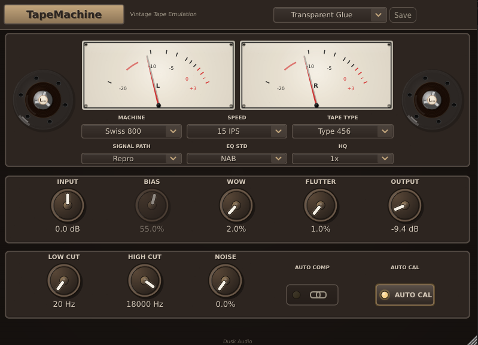
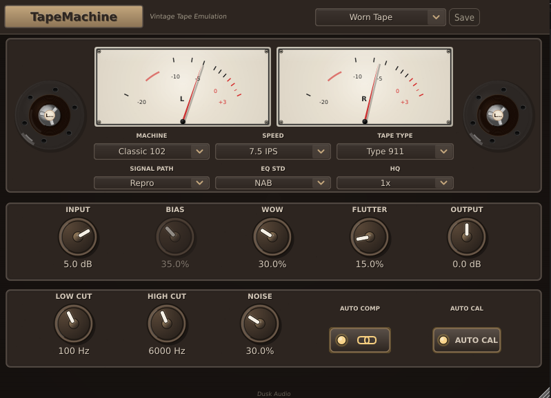
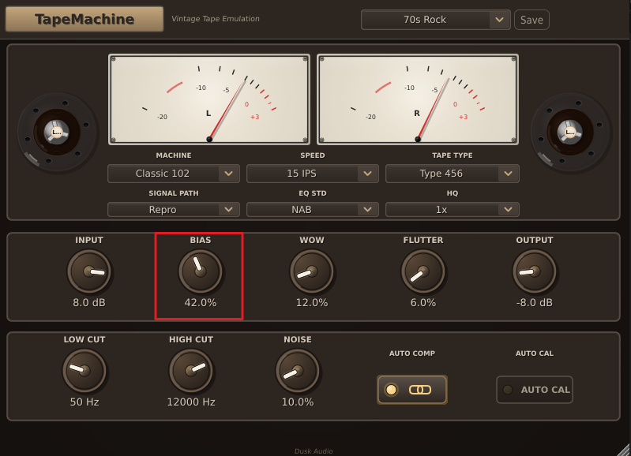
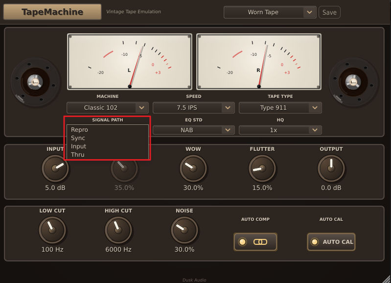
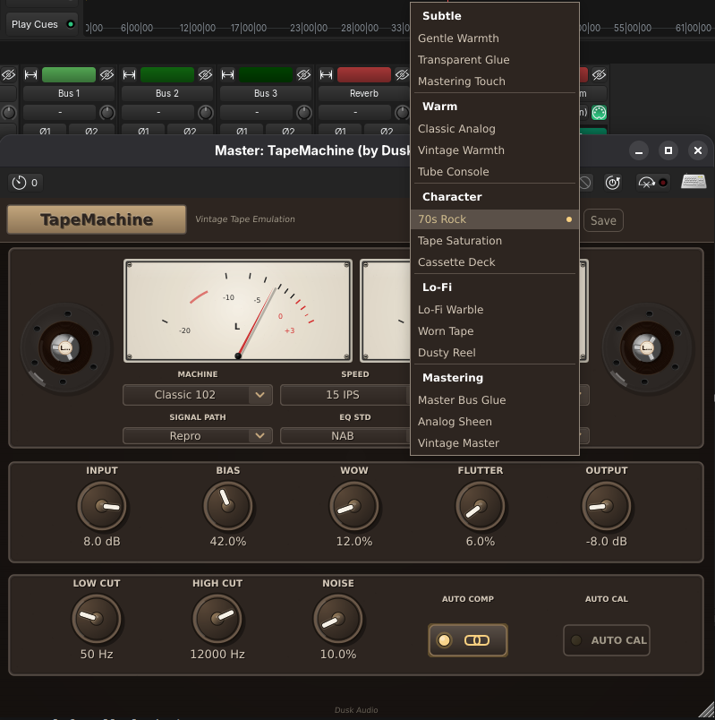

# TapeMachine

## Overview

TapeMachine emulates a professional reel-to-reel tape machine. Two machine models (Swiss 800 and Classic 102) with four tape formulations (Type 456, GP9, 911, 250), three speeds (7.5, 15, 30 IPS), and two EQ standards (NAB, CCIR) cover most of what you would find in a 1970s to 1990s pro studio. On top of that you get separate wow and flutter controls, switchable noise, oversampled saturation, and a four-position signal path so you can hear just the electronics, just the tape, the full chain, or true bypass.

Use it where you would use a real tape machine: subtle bus glue, vocal warmth, drum bus character, gritty character on guitars, or full lo-fi treatment. The machine model and speed affect the high-frequency response (head bump and roll-off); the tape formulation affects the saturation curve and noise floor; bias and calibration determine how hot you can drive before the sound breaks down.

It is not a chorus, flanger, or pitch-shift plugin. The wow and flutter are subtle modulations of the playback speed and behave like real tape; if you want extreme pitch effects, use a dedicated modulation plugin.

## Quick Start

1. Insert TapeMachine on a track or bus. Vocal busses, drum busses, and the master are all common targets.
2. Leave the defaults for your first listen: **Swiss 800**, **15 IPS**, **Type 456**, **Repro** signal path, **NAB** EQ, **Auto Calibration** on, **Saturation** 4%.
3. Compare bypassed against active. You should hear a subtle high-frequency softening and a touch of harmonic warmth.
4. Push **Input Gain** by 4 to 6 dB to drive the saturation harder. Compensate with **Output Gain** to keep levels matched.
5. Try the other machine: switch **Tape Machine** to **Classic 102** for a different head response and more pronounced character.
6. If you want the full vintage effect, raise **Wow** to 10 to 15%, **Flutter** to 5 to 8%, and toggle **Noise Enabled** on with **Noise Amount** around 10%.

You should hear the difference immediately on transients (slightly softer attack), on highs (gentle roll-off above 12 to 15 kHz), and on overall tone (subtle low-mid warmth from the head bump). With Saturation above 10% and Input Gain pushed, the harmonic content becomes audible.

## Workflows

### Subtle warmth on a vocal

**Source:** A clean studio vocal that needs analog character without coloration.
**Goal:** Slight warmth and softening, no obvious tape sound.

Settings:

- **Tape Machine:** Swiss 800
- **Tape Speed:** 30 IPS (cleanest, widest frequency response)
- **Tape Type:** GP9 (low noise, high-output)
- **Signal Path:** Repro
- **EQ Standard:** AES (30 IPS forces this)
- **Input Gain:** +2 dB
- **Saturation:** 8%
- **Wow / Flutter:** 0 / 0 (we want clean speed)
- **Noise Enabled:** Off
- **Output Gain:** -1 dB

Why this works. 30 IPS gives the flattest response and the lowest noise; the high-frequency roll-off is barely audible. GP9 tape is voiced for transparency. A small amount of saturation and input gain delivers the subtle nonlinearity that makes audio "sit" better in a mix without obvious distortion. With wow and flutter at zero, only the EQ shape and saturation contribute. This is the "Mastering Touch" preset's approach.

### Drum bus character with 70s grit

**Source:** Stereo drum bus, mixed and balanced.
**Goal:** Pre-internet-era warmth and a touch of grit.

Settings:

- **Tape Machine:** Classic 102
- **Tape Speed:** 15 IPS
- **Tape Type:** Type 456
- **Signal Path:** Repro
- **EQ Standard:** NAB
- **Input Gain:** +6 dB
- **Saturation:** 35%
- **Bias:** 42% (slightly under-biased for added harmonic content)
- **Wow:** 12%
- **Flutter:** 6%
- **Noise Enabled:** On, **Noise Amount:** 10%
- **Output Gain:** -3 dB

Why this works. Classic 102 is the more colored of the two machines. 15 IPS at NAB gives the classic 1970s head response with audible high-frequency roll-off. Type 456 saturates earlier than the modern formulations. Driving the input by 6 dB pushes the saturation into clearly audible territory. Under-biasing (Bias below 50%) thins the saturation slightly and adds harmonic distortion. Audible wow and flutter complete the era. This is the "70s Rock" preset.

For a less aggressive version, drop Saturation to 20% and Input Gain to +3 dB.

### Cassette tape lo-fi effect

**Source:** Anything you want to sound like it is playing back from a worn cassette.
**Goal:** Audibly degraded, narrow-bandwidth, modulated.

Settings:

- **Tape Machine:** Classic 102
- **Tape Speed:** 7.5 IPS (worst high-frequency response)
- **Tape Type:** Type 250 (highest noise, most coloration)
- **Signal Path:** Repro
- **EQ Standard:** NAB
- **Input Gain:** +4 dB
- **Saturation:** 50%
- **Bias:** 35% (heavily under-biased, distorted)
- **Highpass Frequency:** 80 Hz
- **Lowpass Frequency:** 8000 Hz (thin top end)
- **Wow:** 30%
- **Flutter:** 20%
- **Noise Enabled:** On, **Noise Amount:** 30%
- **Output Gain:** 0 dB

Why this works. 7.5 IPS at the most aggressive tape (Type 250) with heavy under-bias and 50% saturation produces the thick, distorted sound of a cassette running too hot. Audible wow and flutter pitch-shift the playback, completing the cassette illusion. The 8 kHz low-pass narrows the bandwidth dramatically. This roughly matches the "Cassette Deck" preset.

### Mastering bus polish

**Source:** A finished stereo mix.
**Goal:** Inaudible analog flavor, no obvious processing.

Settings:

- **Tape Machine:** Swiss 800
- **Tape Speed:** 30 IPS
- **Tape Type:** GP9
- **Signal Path:** Repro
- **EQ Standard:** AES
- **Input Gain:** +2 dB
- **Saturation:** 6%
- **Bias:** 50% (perfectly biased)
- **Auto Calibration:** On
- **Wow / Flutter:** 0 / 0
- **Noise Enabled:** Off
- **Auto Compensation:** On
- **Oversampling:** 4x
- **Output Gain:** -1 dB

Why this works. Conservative everything: cleanest machine, fastest speed, lowest-noise tape, perfectly biased, no modulation, no noise. Just enough saturation and input gain to add second-harmonic content. 4x oversampling keeps the saturation aliasing-free. A 1 dB cut on the output prevents any chance of clipping into the next plugin. The result should be inaudible on its own; the difference is only obvious on bypass A/B. This matches the "Master Bus Glue" preset.

## Parameter Reference

### Machine and tape

- **Tape Machine:** Swiss 800 (default) or Classic 102. Swiss 800 is the cleaner, more linear machine; Classic 102 has more pronounced head response and saturation character.
- **Tape Speed:** 7.5, 15 (default), or 30 IPS. Faster speed gives flatter frequency response, less noise, and less saturation per dB of input. 7.5 is the most colored and noisy; 30 is the cleanest.
- **Tape Type:** Type 456 (default), GP9, 911, or 250. Different tape formulations have different saturation curves, noise floors, and tonal characters. 456 is the classic Ampex; GP9 is a modern low-noise; 911 is the popular European; 250 has the most character (and the most noise).
- **Signal Path:** Repro (default), Sync, Input, or Thru. Repro is the full signal chain (electronics into tape into reproduce head); Sync uses the record head as the playback head (slightly different EQ); Input is the electronics only with no tape (no saturation or modulation); Thru is true bypass.
- **EQ Standard:** NAB (default), CCIR, or AES. American (NAB) and European (CCIR) tape EQs differ above 1 kHz; AES is mandatory at 30 IPS. The plugin will switch to AES automatically when you pick 30 IPS.

### Drive and tone

- **Input Gain:** -12 to +12 dB. Drives the tape stage. Higher values produce more saturation and harmonic distortion.
- **Saturation:** 0 to 100%, default 4%. The depth of the tape saturation curve. Default is barely audible; 20% is "pleasant"; 50% and above is distortion-heavy.
- **Bias:** 0 to 100%, default 50%. Tape bias level. 50% is perfectly biased (cleanest). Below 50% is under-biased and adds distortion. Above 50% is over-biased and dulls the highs.
- **Calibration:** 0 dB (default), +3, +6, or +9 dB. The reference operating level. Higher calibration means the tape is set to handle louder signals; useful when feeding hot mixes.
- **Auto Calibration:** On (default) or Off. When on, bias and calibration auto-adjust based on tape type and speed for optimal recording. Turn off to set bias manually for creative under- or over-biasing.

### Filtering and modulation

- **Highpass Frequency:** 20 to 500 Hz, default 20. The corner of the input high-pass filter.
- **Lowpass Frequency:** 3 to 20 kHz, default 20 kHz. The corner of the input low-pass filter.
- **Wow:** 0 to 100%, default 7. Slow pitch drift (around 0.3 to 0.8 Hz). Adds vinyl-like wobble at higher values.
- **Flutter:** 0 to 100%, default 3. Faster pitch modulation (3 to 7 Hz). Adds tape machine character at higher values.
- **Noise Amount:** 0 to 100%, default 0. Tape noise floor level.
- **Noise Enabled:** Off (default) or On. Turn on to introduce noise; Noise Amount is the level.

### Output

- **Output Gain:** -12 to +12 dB. Final makeup gain.
- **Auto Compensation:** On (default) or Off. Compensates output level when Input Gain changes, so A/B comparisons are level-matched.
- **Oversampling:** 1x, 2x, or 4x (default). Reduces aliasing from the saturation stage.
- **Bypass:** Reports zero latency to the host while bypassed.

## Tips and Traps

- **Auto Calibration is your friend until you want it not to be.** With Auto Calibration on, switching tape type or speed re-biases the tape for you. Turn it off when you want to creatively under-bias (40 to 45% for grit) or over-bias (55 to 60% for a darker, dulled tone).

  

- **30 IPS forces AES.** This is hardware-accurate behavior; real machines also lock the EQ standard at 30 IPS. Pick 15 or 7.5 IPS if you want NAB or CCIR.
- **Signal Path is not Bypass.** "Thru" is true bypass (signal passes unchanged). "Input" runs the electronics but no tape (no saturation or modulation). "Sync" uses the record head for playback (slightly different EQ). "Repro" is the full chain. Use Sync to compare what the engineer hears during tracking versus the printed tape.

  

- **The default Saturation of 4% is conservative.** If you cannot hear any change versus bypass, raise it to 15 to 25% and pull Input Gain up by a few dB.
- **Wow and Flutter are subtle by default.** 7% Wow and 3% Flutter approximate a well-maintained machine. Push to 15 to 30% for the obviously-vintage sound; below 5% you may not hear them on most material.
- **Noise is a creative tool, not a problem to fix.** When you want the analog floor sound, enable Noise and set Noise Amount to 5 to 15%. For clean work, leave it disabled (the default).

## Presets Explained

TapeMachine ships with 15 presets across 5 categories. Each is a starting point; expect to nudge Input Gain and Saturation to taste.

### Subtle

- **Gentle Warmth.** Swiss 800, 30 IPS, GP9, low saturation. Almost-inaudible analog flavor for transparent work.
- **Transparent Glue.** Similar to Gentle Warmth but slightly more saturation; for bus duty.
- **Mastering Touch.** The cleanest setting in the plugin: 30 IPS, GP9, AES, perfectly biased, no modulation. For mastering bus or any "I want a hint of analog" job.

### Warm

- **Classic Analog.** 15 IPS, Type 456, NAB, moderate drive. The textbook warm tape sound.
- **Vintage Warmth.** Classic 102, 15 IPS, more pronounced head bump, slight wow. For sources that need to feel older.
- **Tube Console.** Heavier saturation with audible second-harmonic content; pairs well with a bus EQ.

### Character

- **70s Rock.** Classic 102, 15 IPS, Type 456, under-biased (42%), audible wow and flutter, noise on. The drum-bus and rock-mix preset.
- **Tape Saturation.** Heavy drive, full saturation. Think parallel-tape bus sound.
- **Cassette Deck.** 7.5 IPS, narrow bandwidth, audible modulation. Lo-fi territory.

### Lo-Fi

- **Lo-Fi Warble.** Heavy wow and flutter, narrow bandwidth, audible noise. Creative-effect preset.
- **Worn Tape.** Even more degraded; for atmospheric or sound-design work.
- **Dusty Reel.** The most extreme; obvious tape grit, modulation, noise. Use sparingly.

### Mastering

- **Master Bus Glue.** Cleanest mastering setting; minimal saturation, no modulation, no noise. Subtle bus glue.
- **Analog Sheen.** Adds a touch of harmonic content to brighten a master without obvious processing.
- **Vintage Master.** A more colored mastering option, with a touch of head bump and very subtle modulation.

## Troubleshooting

**The plugin sounds the same with bypass on and off.** With **Saturation** at 4% and **Input Gain** at 0 dB, the difference is genuinely subtle. Push Saturation to 25% and Input Gain to +6 dB to confirm the plugin is doing something, then dial back to taste.

**Switching to 30 IPS changed my EQ Standard automatically.** That is intentional. Real tape machines lock to AES EQ at 30 IPS; the plugin matches. Pick 15 or 7.5 IPS to use NAB or CCIR.

**The Bias knob does nothing.** Auto Calibration is on by default and overrides manual bias. Turn off **Auto Calibration** in the calibration section, then Bias is yours to drive.

**The CPU usage is high.** 4x oversampling is the default and is the heaviest setting. Drop to 2x for tracking; the audible difference is small but the CPU savings are significant. 1x is appropriate only if you cannot afford the 2x cost; aliasing in the saturation stage becomes audible on bright sources.

**I hear pitch drift even with Wow and Flutter at zero.** Confirm Signal Path is Repro or Sync; if you set everything to zero but still hear drift, restart the plugin (a stuck modulator is rare but possible).
